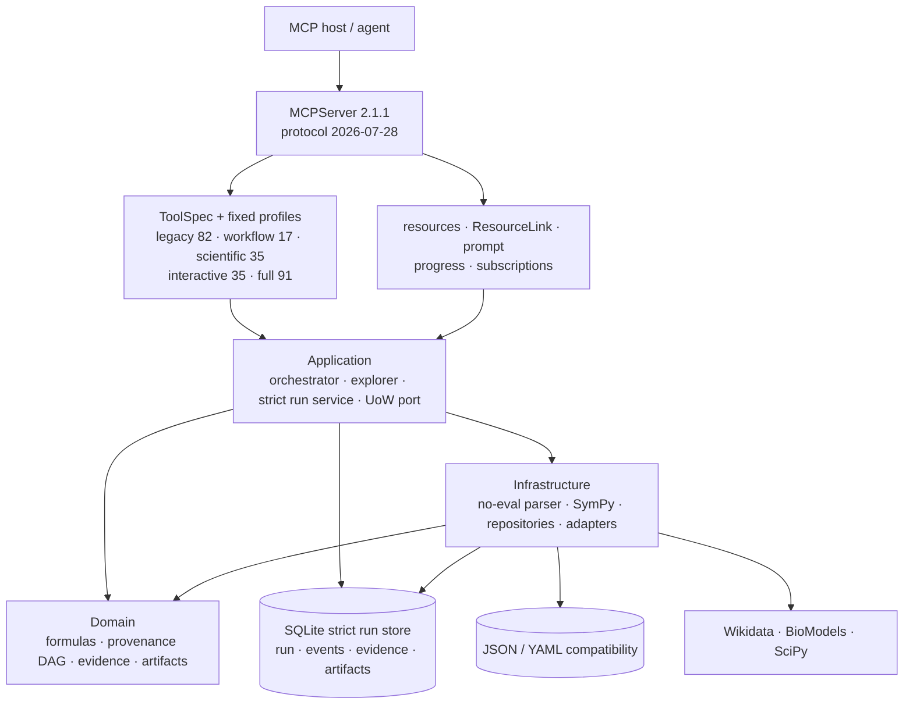
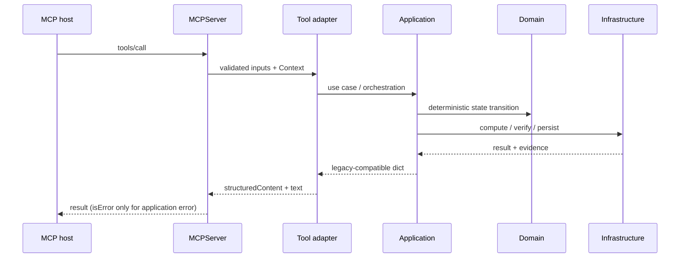

# Architecture

NSForge MCP 架構文件（v0.4.0）

## 系統概覽

NSForge 是一個 Domain-Driven Design（DDD）的神經符號推導系統。AI 負責理解與編排；domain 與 infrastructure 中的確定性元件負責建立、變換、驗證及保存公式。`nsforge` 核心不依賴 MCP，`nsforge_mcp` 是協議邊界。



## 分層與依賴方向

### Domain（`src/nsforge/domain/`）

純業務規則與值物件，不做 I/O，也不依賴 MCP 或 infrastructure。

| 元件 | 責任 |
| --- | --- |
| `derivation_session.py` | Legacy 推導會話、步驟與回滾；歷史 JSON I/O 仍是待拆的相容層債務 |
| `formula.py` / `entities.py` / `value_objects.py` | 公式、實體與值物件 |
| `task_spec.py` | 宣告式 Derivation Task Spec（DTS） |
| `provenance.py` | 工具出生證明帳本與完整性不變量 |
| `strict_provenance.py` | Run、phase event、provenance node、verification evidence 與 artifact 不可變值物件 |
| `codegen.py` | 從已驗證、溯源完整的推導實體化程式碼 |
| `suggester.py` | 候選下一步的確定性排序 |
| `services.py` / `safe_parse.py` | domain 服務介面與安全解析 |

### Application（`src/nsforge/application/`）

協調 domain 與 infrastructure，不承擔傳輸細節。

| 元件 | 責任 |
| --- | --- |
| `task_orchestrator.py` | DTS 的 concept → symbol → derivation → verify → code 流程與 critic-retry |
| `explorer.py` | base 與 alternatives 分支探索、驗證與排序 |
| `use_cases.py` | 推導與公式管理用例 |
| `strict_run.py` | 用同一 phase event stream 驅動 strict provenance、evidence、artifact 與 OTel correlation |
| `run_store.py` | Tenant-scoped `RunStore` / `RunUnitOfWork` application ports |

### Infrastructure（`src/nsforge/infrastructure/`）

可替換的計算、資料來源及持久化 adapter。

| 元件 | 責任 |
| --- | --- |
| `sympy_engine.py` / `verifier.py` | 符號運算與驗證 |
| `derivation_repository.py` | 已存推導的 thread-safe repository 與 atomic YAML 寫入 |
| `timeout.py` | 可終止失控推導的 process timeout |
| `dimensional.py` / `parsing.py` | 維度單一真相與解析 adapter |
| `sqlite_run_store.py` | WAL／foreign keys／optimistic revision 的 atomic strict-run Unit of Work |
| `adapters/` | Wikidata、BioModels、SciPy 等開放來源 |

### MCP boundary（`src/nsforge_mcp/`）

MCP Python SDK 2.1.1 的薄協議層。

| 元件 | 責任 |
| --- | --- |
| `server.py` | `MCPServer` factory、lifespan、cache hints 與 transport 啟動 |
| `composition.py` | process-wide `Services` 組合根 |
| `config.py` | fixed tool profile、tenant、artifact root 與 transport 安全設定 |
| `envelope.py` | 結構化輸出、錯誤 semantics 與 `ResourceLink` content blocks |
| `tool_contract.py` | 91-tool `ToolSpec`、profile membership、descriptions、constraints 與 metadata 單一真相 |
| `introspection.py` | capability manifest 與 health payload |
| `primitives.py` | discovery、detached session、saved derivation、strict run/event/artifact resources 與 prompt |
| `tools/` | 11 個模組、91 個工具的 adapter；預設註冊 82 個 |

依賴方向保持為：

```text
MCP boundary → Application → Domain ← Infrastructure
```

## MCP 2.1 協議契約

NSForge 0.4.0 精確 pin `mcp==2.1.1`，對應協議修訂版 `2026-07-28`。
`legacy` 82 與 `full` 91 保留 v0.3 工具名稱與 payload；compact profiles
另透過 server call boundary 拒絕未知欄位，並實作 enum／numeric constraints。

每個工具在註冊邊界統一取得：

- `title` 與 NSForge icon；
- `readOnlyHint`、`destructiveHint`、`idempotentHint`、`openWorldHint`；
- `org.nsforge/*` namespaced `_meta`；
- 明確設定 `structured_output=True`；保留 SDK 1.25 已提供的 output schema 與 dual-channel 結果。

SDK 1.25 已讓成功結果同時提供文字內容與 `structuredContent`；升級後兩個 channel 的 body／hash 維持不變。既有 handled error 與未處理例外也維持原本 JSON body，本次另以 MCP `isError=true` 提供明確的失敗 semantic signal；數學驗證結果為 false、但沒有 `error` 欄位時仍是正常工具結果。

`task_run` 與 `task_explore` 接受 MCP `Context`；真實 phase events 同時用於
ordered persistence、progress 與 OTel span events。同步工具由 SDK worker
thread 執行，因此可變狀態不能假設單執行緒。

## Fixed tool profiles 與輸入契約

Profile 僅在 server construction 時決定，同一連線內不會動態變更
`tools/list`。`ToolSpec` 同時供 runtime registration、manifest、health 與契約測試
使用；未知 tool 或 profile fail closed。

| Profile | Tools | 契約 |
| --- | ---: | --- |
| `legacy` | 82 | v0.3-compatible；舊 music opt-in 仍可擴為 91 |
| `workflow` | 17 | resource-first，strict unknown-field／enum／range validation |
| `scientific` | 35 | stateless calculation／simplification／verification 嚴格面 |
| `interactive` | 35 | workflow 加 session edit／handoff／untrusted manual input |
| `full` | 91 | 完整相容與 discovery 面，含 music |

Compact descriptions 僅保留選工具所需資訊；教學與範例回到 docs／prompt。
`symbolic_equal` 保留為 `verify_equality` 的 deprecated compatibility alias。

## Strict provenance kernel

Strict task workflow 用 application service 建立 server-generated `run_id` 與
`correlation_id`，再將 run、單調 sequence 事件、provenance DAG、verification
evidence、artifact metadata／bytes 於同一 SQLite transaction 提交。

Codegen eligibility 是 fail closed：evidence 必須由 kernel verifier 產生、outcome
為 pass、subject digest／tenant／revision／policy 一致，且 provenance DAG 完整。
Caller assertion 可被記錄卻永遠不是 trusted evidence。Artifact 以 content SHA-256
尋址且不可變；工具 payload 只附簡要 metadata 與 `ResourceLink`。

Expression trust boundary 統一走 allowlisted AST constructor；禁止 `eval`、attribute、
import、lambda、comprehension 與未允許 callable。Repository category、artifact name
與 music output 均做 path normalization、containment 與 symlink escape 檢查。

## Discovery primitives

Tools 仍是主要寫入／計算介面；MCP 2.1 primitives 以加法方式提供 discovery-first UX。

| 類型 | 名稱 | 用途 |
| --- | --- | --- |
| Resource | `nsforge://manifest` | 工具、模組、gate 與 MCP 契約 |
| Resource | `nsforge://health` | runtime、SDK、協議、引擎與 active tool inventory |
| Resource | `nsforge://north-star` | provenance 北極星不變量 |
| Resource template | `nsforge://derivations/{result_id}` | 依 ID 讀取已存公式 metadata 與 lineage 摘要 |
| Resource template | `nsforge://sessions/{session_id}` | Workflow 使用的 detached legacy-session snapshot |
| Resource template | `nsforge://runs/{run_id}` | Immutable tenant-scoped run、provenance、evidence 與 artifact metadata |
| Resource template | `nsforge://runs/{run_id}/events` | Ordered digest-linked phase events |
| Resource template | `nsforge://artifacts/{sha256}` | Content-addressed immutable artifact bytes |
| Prompt | `forge_verified_derivation` | 產生 provenance-first 的驗證推導工作流 |

`tools/list`、resource／template／prompt list 及 server discovery 使用五分鐘 public
cache hint；`health` 等動態 resource read 不套用這個 cache。Run 完成後會針對
其 resource URIs 發 updated notification，但 subscription metadata 不是 ACL。

## Tool surface

| 模組 | 數量 | 說明 |
| --- | :---: | --- |
| Derivation | 31 | Stateful session、推導步驟、repository、handoff |
| Calculate | 12 | 極限、級數、求和、不等式、機率、數值 |
| Simplify | 14 | 進階代數與 Laplace／Fourier 變換 |
| Verify | 6 | 等價、導數、積分、解、維度與反向驗證 |
| Formula | 6 | Wikidata、BioModels、SciPy 等公式來源 |
| Codegen | 4 | Python、LaTeX、Markdown、SymPy script |
| Expression | 3 | parse、validate、extract symbols |
| Task | 3 | plan、run、explore |
| Suggest | 1 | retrieval-augmented next-step ranking |
| Meta | 2 | health 與 manifest tools |
| Music（opt-in） | 9 | symbolic audio demo；`NSFORGE_ENABLE_MUSIC=1` |

總目錄 91；profile 精確數量為 legacy 82、workflow 17、scientific 35、
interactive 35、full 91。完整名稱與 metadata 以
[`docs/tools-reference.md`](docs/tools-reference.md) 與
[`docs/agent/capabilities.json`](docs/agent/capabilities.json) 為準。
該 manifest 於 v0.4.0 升為 schema v4，納入 profiles 與 strict constraints。

## Transport 與部署邊界

stdio 是預設 transport，也是本機 host 整合的建議值。Streamable HTTP 必須明確設定 `NSFORGE_MCP_TRANSPORT=streamable-http`；預設只綁定 `127.0.0.1:8000/mcp`。

所有 HTTP bind 都明確傳入 MCP 2.1 `TransportSecuritySettings`，以 Host／Origin allowlist 防範 DNS rebinding。非 loopback 位址還必須設 `NSFORGE_MCP_ALLOW_REMOTE=1` 與非空的 `NSFORGE_MCP_ALLOWED_HOSTS`；瀏覽器 caller 另設精確的 `NSFORGE_MCP_ALLOWED_ORIGINS`。Origin allowlist 留空只允許沒有 Origin header 的非瀏覽器 client，任何 supplied Origin 都會被拒絕。這些設定只是 transport 防護，不是驗證機制；對外服務仍需由 reverse proxy／gateway 提供真實的 authentication、authorization 與 TLS。

`NSFORGE_TENANT_ID` 由 server configuration 捕捉，strict store 的每個 query 都帶
tenant scope；client 無法以 tool argument 覆寫。這仍不是 caller authentication：未接
可信 IdP／token verifier／principal resolver 時，一個 server instance 就是一個 tenant
trust boundary。

Legacy session registry、current-session fallback 與 saved-result JSON／YAML repository 仍是
process-wide 相容層；多 client 的 legacy stateful calls 必須傳 explicit `session_id`。
SQLite strict store 雖比 JSON／YAML 具有 transaction、revision 與不可變性，但仍是本機
store，不會在 replicas 間共享。水平擴展需要 shared DB、artifact backend、
distributed coordination 與可信 principal boundary。若開啟
`NSFORGE_MCP_HTTP_JSON_RESPONSE=1`，request-scoped progress 沒有串流通道。

## 狀態、lifecycle 與並行安全

MCP 2.x 可能讓多個工具同時進入同一 process。NSForge 因此在三個層次保護狀態：

1. `SessionManager` 鎖保護 session registry。
2. 每個 `DerivationSession` 以 re-entrant lock 序列化 mutation 與複合 transaction；compound read 取得 detached point-in-time snapshot。
3. `DerivationRepository` 以 re-entrant lock 保護索引，並用同目錄暫存檔與 atomic replace 寫入 YAML。

不同 session 仍可並行；同一 session 的 mutation 不會交錯，compound read
只看見單一時間點。這是 legacy compatibility 的 process 內一致性，不取代
tenant isolation。

Strict run 以 ordered phase events 記錄 running／verification／artifact 過程，再於完成
邊界將 final run bundle 單一 transaction 持久化；不宣稱每個中間 status 都有
獨立 committed revision。Terminal revision 不可就地改寫；SQLite UoW 使用
optimistic revision 將 run／event／provenance／evidence／artifact 全數提交或 rollback。

Thread cancellation 是已知 Python 限制：取消 `asyncio.to_thread` 的 await 不會殺掉
worker，因此不在 `finally` 誤發 Finished。需要 hard timeout 時使用可 terminate
的 process runner；該隔離路徑保存相同 phase events，但在 process 回傳後才重播
progress，逐 phase 即時通知僅適用預設無 timeout 路徑。MCP Tasks extension 未由
Python SDK 2.1.1 實作，本版不假裝支援。

## 典型資料流



## 驗證契約

`python scripts/check.py` 是單一 ground truth，共 14 個 gate：

```text
lint · format · type · security · import · manifest · mcp · test · bench · generic · provenance · package · harness · diff
```

其中 `mcp` 檢查各 profile exact surface、legacy payload、strict validation、
ResourceLink／resources／progress／notifications 與客戶相容；`security` 阻擋 high-severity
static findings；`package` 建立 sdist／wheel 並在隔離環境驗證安裝後 MCP。

## 相關文件

- [README.md](README.md) — 安裝、使用與部署設定
- [MCP v2 migration](docs/mcp-v2-migration.md) — 升級設計與相容性矩陣
- [Tool reference](docs/tools-reference.md) — 完整工具與 primitives 參考
- [Reification ladder](docs/reification-ladder-direction.md) — 北極星與長期方向
- [CONSTITUTION.md](CONSTITUTION.md) — 開發原則
