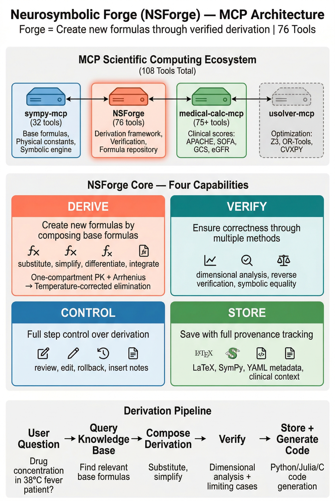
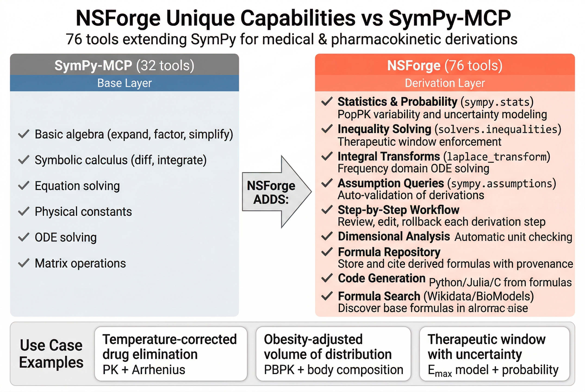
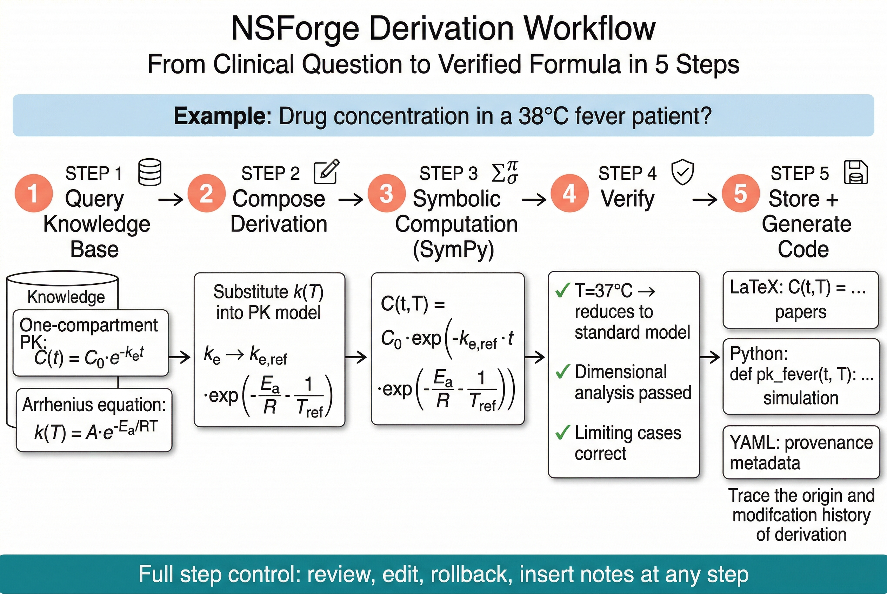

# 🔥 Neurosymbolic Forge (NSForge)

> **"Forge" = CREATE new formulas through verified derivation**

[](LICENSE)
[](https://www.python.org/)
[](https://modelcontextprotocol.io/)

🌐 **English** | [繁體中文](README.zh-TW.md)

## 🔨 Core Concept: The "Forge"

**NSForge is NOT a formula database** — it's a **derivation factory** that CREATES new formulas.

```text
┌─────────────────────────────────────────────────────────────────────────────┐
│                                                                             │
│   🔨 FORGE = Create new formulas through derivation                         │
│                                                                             │
│   Input: Base formulas          Output: NEW derived formulas                │
│   ┌─────────────────────┐       ┌─────────────────────────────────────┐    │
│   │ • One-compartment   │       │ Temperature-corrected elimination   │    │
│   │ • Arrhenius         │  ──→  │ Body fat-adjusted distribution      │    │
│   │ • Fick's law        │       │ Renal function dose adjustment      │    │
│   │ • ...               │       │ Custom PK/PD models                 │    │
│   └─────────────────────┘       └─────────────────────────────────────┘    │
│         (from sympy-mcp)                    (stored in NSForge)            │
│                                                                             │
└─────────────────────────────────────────────────────────────────────────────┘
```

## ⚡ Four Core Capabilities

| Capability | Description | Tools |
| ---------- | ----------- | ----- |
| **DERIVE** | Create new formulas by composing base formulas | `substitute`, `simplify`, `differentiate`, `integrate` |
| **CONTROL** | Full step control: review, edit, rollback, insert | `get_step`, `update_step`, `rollback`, `delete_step`, `insert_note` |
| **VERIFY** | Ensure correctness through multiple methods | `check_dimensions`, `verify_derivative`, `symbolic_equal` |
| **STORE**  | Save derived formulas with full provenance | `formulas/derivations/` repository |

---

## 🌍 Ecosystem: Don't Reinvent the Wheel

<p align="center">
  
</p>

NSForge works WITH other MCP servers, not against them:

```text
┌─────────────────────────────────────────────────────────────────────────────┐
│                    MCP Scientific Computing Ecosystem                       │
│                         🔢 108 Tools Total 🔢                               │
├─────────────────────────────────────────────────────────────────────────────┤
│  sympy-mcp (32 tools)                                                       │
│  └── Base formulas: F=ma, PV=nRT, Arrhenius...                             │
│  └── Physical constants: c, G, h, R... (SciPy CODATA)                      │
│  └── Symbolic computation engine (ODE, PDE, matrices)                      │
├─────────────────────────────────────────────────────────────────────────────┤
│  nsforge-mcp (76 tools) ← YOU ARE HERE                                      │
│  └── 🔨 Derivation framework: compose, verify, generate code               │
│  └── 📁 Derivation repository: store CREATED formulas with provenance      │
│  └── ✅ Verification layer: dimensional analysis, reverse verification     │
│  └── 🌐 Formula search: Wikidata, BioModels, SciPy constants               │
│  └── 🔗 Optimization bridge: prepare formulas for USolver                  │
├─────────────────────────────────────────────────────────────────────────────┤
│  medical-calc-mcp (75+ tools)                                               │
│  └── Clinical scores: APACHE, SOFA, GCS, MELD, qSOFA...                    │
│  └── Medical calculations: eGFR, IBW, BSA, MEWS...                         │
├─────────────────────────────────────────────────────────────────────────────┤
│  usolver-mcp (Optional collaboration)                                       │
│  └── 🎯 Find optimal values for NSForge-derived formulas                   │
│  └── Solvers: Z3, OR-Tools, CVXPY, HiGHS                                   │
│  └── Use case: dose optimization, circuit parameter selection              │
└─────────────────────────────────────────────────────────────────────────────┘
```

**What NSForge stores:**

| ✅ BELONGS in NSForge | ❌ Does NOT belong (use other tools) |
| --------------------- | ------------------------------------ |
| Temperature-corrected drug elimination | Basic physics formulas (sympy-mcp) |
| Body fat-adjusted volume of distribution | Physical constants (sympy-mcp) |
| Renal function dose adjustments | Clinical scores (medical-calc-mcp) |
| Custom composite PK/PD models | Textbook formulas (references) |

---

## 🚀 NSForge Unique Capabilities

<p align="center">
  
</p>

NSForge provides features **not available in SymPy-MCP** by directly leveraging SymPy modules:

| Feature | SymPy Module | Application | Status |
| ------- | ------------ | ----------- | ------ |
| **Statistics & Probability** | `sympy.stats` | PopPK variability, uncertainty | ✅ v0.2.1 |
| **Limits & Series** | `sympy.limit`, `sympy.series` | Steady-state, accumulation | ✅ v0.2.1 |
| **Inequality Solving** | `sympy.solvers.inequalities` | Therapeutic window | ✅ v0.2.1 |
| **Assumption Queries** | `sympy.assumptions` | Auto-validation | ✅ v0.2.1 |
| **Advanced Algebra** | `sympy.expand/factor/apart...` | Expression manipulation | ✅ v0.2.4 |
| **Integral Transforms** | `sympy.laplace_transform/fourier_transform` | ODE solving, frequency analysis | ✅ v0.2.4 |
| **Derivation Workflow** | NSForge exclusive | Step tracking, provenance | ✅ Available |
| **Verification Suite** | NSForge exclusive | Dimension analysis | ✅ Available |

> 📖 **Details**: See [NSForge vs SymPy-MCP Comparison](docs/nsforge-vs-sympy-mcp.md) for complete analysis.

---

## 🎬 Workflow

<p align="center">
  
</p>

```text
┌────────────────────────────────────────────────────────────────────────────┐
│                                                                            │
│   User Question                   NSForge Processing Pipeline              │
│   ═════════════                   ═══════════════════════════              │
│                                                                            │
│   "Drug concentration in         1️⃣ Query Formula Knowledge Base           │
│    a 38°C fever patient?"   ──→     ├─ One-compartment PK: C(t) = C₀·e^(-kₑt)
│                                     └─ Arrhenius equation: k(T) = A·e^(-Ea/RT)
│                                                                            │
│                                  2️⃣ Compose Derivation                      │
│                                     ├─ Substitute k(T) into PK model       │
│                                     └─ Obtain temperature-corrected formula│
│                                                                            │
│                                  3️⃣ Symbolic Computation (SymPy)            │
│                                     └─ C(t,T) = C₀·exp(-kₑ,ref·t·exp(...)) │
│                                                                            │
│                                  4️⃣ Verify Results                          │
│                                     ├─ T=37°C reduces to standard model ✓  │
│                                     └─ Dimensional analysis passed ✓       │
│                                                                            │
└────────────────────────────────────────────────────────────────────────────┘
```

---

## 🎛️ Step-by-Step Control (NEW in v0.2.2)

NSForge now provides **full CRUD control over derivation steps**:

```text
┌────────────────────────────────────────────────────────────────────────────┐
│  🎛️ STEP CONTROL - Navigate and Edit Your Derivation!                     │
├────────────────────────────────────────────────────────────────────────────┤
│                                                                            │
│   Step 1 → Step 2 → Step 3 → Step 4 → Step 5 → Step 6  (current)          │
│                        ↑                                                   │
│                        │                                                   │
│   "Wait, step 3 looks wrong..."                                           │
│                                                                            │
│   ┌──────────────────────────────────────────────────────────────────┐    │
│   │  🔍 READ    │ derivation_get_step(3) → View step details         │    │
│   │  ✏️ UPDATE  │ derivation_update_step(3, notes="...") → Fix notes │    │
│   │  ⏪ ROLLBACK│ derivation_rollback(2) → Return to step 2          │    │
│   │  📝 INSERT  │ derivation_insert_note(2, "...") → Add explanation │    │
│   │  🗑️ DELETE  │ derivation_delete_step(6) → Remove last step       │    │
│   └──────────────────────────────────────────────────────────────────┘    │
│                                                                            │
│   After rollback: Step 1 → Step 2  (now current)                          │
│   → Continue derivation from step 2, try a different path!                │
│                                                                            │
└────────────────────────────────────────────────────────────────────────────┘
```

### Step CRUD Tools (5 new tools)

| Tool | Operation | Description |
|------|-----------|-------------|
| `derivation_get_step` | **Read** | Get details of any step (expression, notes, assumptions) |
| `derivation_update_step` | **Update** | Modify metadata (notes, assumptions, limitations) - NOT expression |
| `derivation_delete_step` | **Delete** | Remove the LAST step only (safety constraint) |
| `derivation_rollback` | **Rollback** | ⚡ Jump back to any step, delete subsequent steps |
| `derivation_insert_note` | **Insert** | Add explanatory note at any position |

> 💡 **Key Insight**: Expressions can't be edited directly (that would break verification). Use `rollback` to return to a valid state, then re-derive with corrections.

### Use Cases

1. **Peer Review**: "Step 5's assumption is questionable" → `update_step(5, notes="Validated for T<42°C only")`
2. **Wrong Path**: "We should have used integration instead" → `rollback(3)` → start fresh
3. **Add Context**: "Need to explain the Arrhenius substitution" → `insert_note(4, "Temperature effect on enzyme kinetics...")`
4. **Clean Up**: "Last step was a mistake" → `delete_step(8)`

---

## 🧠 Why NSForge?

```text
┌─────────────────────────────────────────────────────────────────────────────┐
│                                                                             │
│   Problem: LLMs doing math directly                                         │
│   ═════════════════════════════════                                         │
│                                                                             │
│   ❌ May calculate wrong        ❌ Different results      ❌ Unverifiable   │
│      (hallucinations)              each time                                │
│                                                                             │
│   ═══════════════════════════════════════════════════════════════════════   │
│                                                                             │
│   Solution: LLM + NSForge                                                   │
│   ═══════════════════════                                                   │
│                                                                             │
│   LLM handles:                      NSForge handles:                        │
│   ┌─────────────────────┐          ┌─────────────────────┐                 │
│   │ • Understand query  │          │ • Store verified    │                 │
│   │ • Plan derivation   │    ──→   │   formulas          │                 │
│   │ • Explain results   │          │ • Precise symbolic  │                 │
│   └─────────────────────┘          │   computation       │                 │
│      "Understanding                │ • Track derivation  │                 │
│       & Planning"                  │   sources           │                 │
│                                    │ • Verify results    │                 │
│                                    └─────────────────────┘                 │
│                                       "Computation                         │
│                                        & Verification"                     │
│                                                                             │
│   ✅ Guaranteed correct    ✅ Reproducible    ✅ Fully traceable            │
│                                                                             │
└─────────────────────────────────────────────────────────────────────────────┘
```

---

## 📚 Derivation Repository Architecture

NSForge stores **derived formulas** with full provenance tracking:

```text
formulas/
└── derivations/                    ← All derived formulas go here
    ├── README.md                   ← Documentation
    └── pharmacokinetics/           ← PK model derivations
        ├── temp_corrected_elimination.md   ← Temperature-corrected k
        └── fat_adjusted_vd.md              ← Obesity-adjusted Vd
```

**Each derivation result contains:**

- LaTeX mathematical expression
- SymPy computable form  
- **Derived from**: which base formulas were combined
- **Derivation steps**: the actual derivation process
- **Verification status**: dimensional analysis, limiting cases
- Clinical context and usage guidance
- YAML metadata for programmatic access

**Example Derivations:**

| Derivation | Domain | Description |
|------------|--------|-------------|
| [Temperature-Corrected Elimination](formulas/derivations/pharmacokinetics/temp_corrected_elimination.md) | PK | First-order elimination + Arrhenius temperature dependence |
| [NPO Antibiotic Effect](formulas/derivations/pharmacokinetics/npo_antibiotic_effect.md) | PK/PD | Henderson-Hasselbalch + Emax model for pH-dependent absorption |
| [Temperature-Corrected Michaelis-Menten](formulas/derivations/pharmacokinetics/temp_corrected_michaelis_menten.md) | PK | Non-linear saturable kinetics with temperature effects |
| [Cisatracurium Multiple Dosing](formulas/derived/ce30161d.yaml) | PK | Hydrolytic drug accumulation with temperature correction |
| [Physiological Vd Body Composition](formulas/derivations/pharmacokinetics/physiological_vd_body_composition.md) | PK/PBPK | PBPK-based Vd adjustment for body composition (logP > 2) |

**Example: NPO (Fasting) Impact on Antibiotic Efficacy**

```yaml
id: npo_antibiotic_effect
name: NPO Impact on Oral Antibiotic Efficacy
expression: E_0 + (E_max * C_eff^n) / (EC_50^n + C_eff^n)
  where: C_eff = F_base * D / (Vd * (1 + 10^(pH - pKa)))
derived_from:
  - henderson_hasselbalch       # pH-dependent ionization
  - emax_model                  # Pharmacodynamic effect
verified: true
verification_method: sympy_symbolic_substitution
clinical_context: |
  Predicts reduced antibiotic efficacy in NPO patients due to 
  increased gastric pH. Critical for weak acid antibiotics like 
  Amoxicillin (pKa=2.4) where NPO can reduce effect by >90%.
```

**See also:** [Python Implementation](examples/npo_antibiotic_analysis.py) with clinical recommendations.

---

## ✨ Features

| Category | Capabilities |
| ---- | ---- |
| 🔢 **Symbolic Computation** | Calculus, Algebra, Linear Algebra, ODE/PDE |
| 📖 **Formula Management** | Storage, Query, Version Control, Source Tracking |
| 🔄 **Derivation Composition** | Multi-formula composition, Variable substitution, Condition modification |
| ✅ **Result Verification** | Dimensional analysis, Boundary conditions, Reverse verification |
| 🐍 **Code Generation** | Generate Python functions from symbolic formulas |

## 📦 Installation

### Requirements

- **Python 3.12+**
- **uv** (recommended package manager)

```bash
# Using uv (recommended)
uv add nsforge-mcp

# Or using pip
pip install nsforge-mcp
```

### From Source

```bash
git clone https://github.com/u9401066/nsforge-mcp.git
cd nsforge-mcp

# Create environment and install dependencies
uv sync --all-extras

# Verify installation
uv run python -c "import nsforge; print(nsforge.__version__)"
```

## 🚀 Quick Start

### As MCP Server

```json
// Claude Desktop config (claude_desktop_config.json)
{
  "mcpServers": {
    "nsforge": {
      "command": "uvx",
      "args": ["nsforge-mcp"]
    }
  }
}
```

### Usage Examples

**Calculus computation**:

```text
User: Calculate ∫(x² + 3x)dx and verify the result

Agent calls NSForge:
→ Result: x³/3 + 3x²/2 + C
→ Verify: d/dx(x³/3 + 3x²/2) = x² + 3x ✓
→ Steps: Split integral → Power rule → Combine
```

**Physics derivation**:

```text
User: Work done by ideal gas in isothermal expansion?

Agent calls NSForge:
→ W = nRT ln(V₂/V₁)
→ Derivation: PV=nRT → P=nRT/V → W=∫PdV → Integrate
```

**Algorithm analysis**:

```text
User: Analyze T(n) = 2T(n/2) + n

Agent calls NSForge:
→ T(n) = Θ(n log n)
→ Method: Master Theorem Case 2
→ Example: Merge Sort
```

## 📖 Documentation

### Design Documents

- [Design Evolution: Derivation Framework](docs/design-evolution-derivation-framework.md) - Architecture evolution from templates to composable derivation framework
- [Domain Planning: Audio Circuits](docs/domain-audio-circuits.md) - Audio circuits principles and modifications
- [Original Design](docs/symbolic-reasoning-mcp-design.md) - Complete architecture and API design (reference)

### Example Derivations

- [Power Amp Coupling Capacitor Design](docs/examples/power-amp-coupling-capacitor.md) - Complete RC high-pass filter derivation
  - From ideal formulas to practical considerations (output impedance, ESR, speaker impedance curve)
  - Demonstrates NSForge "Principles + Modifications" framework in practice

### API Reference

- [API Reference](docs/api.md) - MCP tool documentation (TBD)

## 🛠️ MCP Tools

NSForge provides **75 MCP tools** organized into 7 modules:

### 🔥 Derivation Engine (31 tools)

| Tool | Purpose |
| ---- | ---- |
| `derivation_start` | Start a new derivation session |
| `derivation_resume` | Resume a previous session |
| `derivation_list_sessions` | List all sessions |
| `derivation_status` | Get current session status |
| `derivation_show` | 🆕 **Display current formula** (like SymPy's print_latex_expression) |
| `derivation_load_formula` | Load base formulas |
| `derivation_substitute` | Variable substitution |
| `derivation_simplify` | Simplify expression |
| `derivation_solve_for` | Solve for variable |
| `derivation_differentiate` | Differentiate expression |
| `derivation_integrate` | Integrate expression |
| `derivation_record_step` | Record step with notes (**⚠️ MUST display formula to user after!**) |
| `derivation_add_note` | Add human insights |
| `derivation_get_steps` | Get all derivation steps |
| `derivation_get_step` | Get single step details |
| `derivation_update_step` | Update step metadata |
| `derivation_delete_step` | Delete last step |
| `derivation_rollback` | ⚡ Rollback to any step |
| `derivation_insert_note` | Insert note at position |
| `derivation_complete` | Complete and save |
| `derivation_abort` | Abort current session |
| `derivation_list_saved` | List saved derivations |
| `derivation_get_saved` | Get saved derivation |
| `derivation_search_saved` | Search derivations |
| `derivation_repository_stats` | Repository statistics |
| `derivation_update_saved` | Update metadata |
| `derivation_delete_saved` | Delete derivation |
| `derivation_export_for_sympy` | 🆕 Export state to SymPy-MCP |
| `derivation_import_from_sympy` | 🆕 Import result from SymPy-MCP |
| `derivation_handoff_status` | 🆕 Check handoff capabilities |
| `derivation_prepare_for_optimization` | 🆕 Prepare for USolver |

### ✅ Verification (6 tools)

| Tool | Purpose |
| ---- | ---- |
| `verify_equality` | Verify two expressions are equal |
| `verify_derivative` | Verify derivative by integration |
| `verify_integral` | Verify integral by differentiation |
| `verify_solution` | Verify equation solution |
| `check_dimensions` | Dimensional analysis |
| `reverse_verify` | Reverse operation verification |

### 🔢 Calculation (12 tools)

| Tool | Purpose |
| ---- | ---- |
| `calculate_limit` | Calculate limits |
| `calculate_series` | Taylor/Laurent series expansion |
| `calculate_summation` | Symbolic summation Σ |
| `solve_inequality` | Solve single inequality |
| `solve_inequality_system` | Solve system of inequalities |
| `define_distribution` | Define probability distribution |
| `distribution_stats` | Get distribution statistics (mean, var, skew) |
| `distribution_probability` | Calculate probability P(condition) |
| `query_assumptions` | Query symbol assumptions |
| `refine_expression` | Refine expression with assumptions |
| `evaluate_numeric` | Numerical evaluation |
| `symbolic_equal` | Symbolic equality check |

### 📝 Expression (3 tools)

| Tool | Purpose |
| ---- | ---- |
| `parse_expression` | Parse mathematical expression |
| `validate_expression` | Validate expression syntax |
| `extract_symbols` | Extract symbols with metadata |

### 💻 Code Generation (4 tools)

| Tool | Purpose |
| ---- | ---- |
| `generate_python_function` | Generate Python function |
| `generate_latex_derivation` | Generate LaTeX document |
| `generate_derivation_report` | Generate Markdown report |
| `generate_sympy_script` | Generate standalone SymPy script |

### 🔢 Advanced Algebra (10 tools) - NEW in v0.2.4

| Tool | Purpose |
| ---- | ---- |
| `expand_expression` | Expand products: (x+1)² → x²+2x+1 |
| `factor_expression` | Factorize: x²-1 → (x-1)(x+1) |
| `collect_expression` | Collect terms by variable |
| `trigsimp_expression` | Trig simplify: sin²+cos² → 1 |
| `powsimp_expression` | Power simplify: x²·x³ → x⁵ |
| `radsimp_expression` | Radical simplify |
| `combsimp_expression` | Factorial simplify: n!/(n-2)! → n(n-1) |
| `apart_expression` | 🔥 Partial fractions (for inverse Laplace) |
| `cancel_expression` | Cancel common factors |
| `together_expression` | Combine fractions |

### 📊 Integral Transforms (4 tools) - NEW in v0.2.4

| Tool | Purpose |
| ---- | ---- |
| `laplace_transform_expression` | 🔥 f(t) → F(s) for ODE solving |
| `inverse_laplace_transform_expression` | 🔥 F(s) → f(t) multi-compartment PK |
| `fourier_transform_expression` | f(x) → F(k) frequency analysis |
| `inverse_fourier_transform_expression` | F(k) → f(x) signal reconstruction |

### 🌐 Formula Search (6 tools) - NEW in v0.2.4

| Tool | Purpose |
| ---- | ---- |
| `formula_search` | 🔍 Unified search (Wikidata, BioModels, SciPy) |
| `formula_get` | 📄 Get formula details by ID |
| `formula_categories` | 📂 List available categories |
| `formula_pk_models` | 💊 PK models (1/2-compartment, Michaelis-Menten) |
| `formula_kinetic_laws` | ⚗️ Reaction kinetics (Hill, etc.) |
| `formula_constants` | 🔬 Physical constants (from SciPy) |

## 🧠 Agent Skills Architecture

NSForge includes **19 pre-built Skills** that teach AI agents how to use the tools effectively:

### 🔥 NSForge-Specific Skills (6)

| Skill | Trigger Words | Description |
| ----- | ------------- | ----------- |
| `nsforge-derivation-workflow` | derive, 推導, prove | Complete derivation workflow with session management |
| `nsforge-formula-management` | list, 公式庫, find formula | Query, update, delete saved formulas |
| `nsforge-formula-search` | Wikidata, BioModels, 物理常數 | 🆕 Search external formula sources |
| `nsforge-verification-suite` | verify, check, 維度 | Equality, derivative, integral, dimension checks |
| `nsforge-code-generation` | generate, export, LaTeX | Python functions, reports, SymPy scripts |
| `nsforge-quick-calculate` | calculate, simplify, solve | Quick calculations without session |

### 🔧 General Development Skills (13)

Includes `git-precommit`, `memory-updater`, `code-reviewer`, `test-generator`, and more.

> 📖 **Details**: See [NSForge Skills Guide](docs/nsforge-skills-guide.md) for complete documentation.

### Golden Rule: SymPy-MCP First!

```text
┌─────────────────────────────────────────────────────────────────┐
│  Phase 1: SymPy-MCP executes computation                        │
│     intro_many([...]) → introduce_expression(...) →             │
│     substitute/solve/dsolve... → print_latex_expression(...)   │
├─────────────────────────────────────────────────────────────────┤
│  Phase 2: NSForge records & stores                              │
│     derivation_record_step(...) → derivation_add_note(...) →    │
│     derivation_complete(...)                                    │
└─────────────────────────────────────────────────────────────────┘
```

**Division of Labor:**

| Task | Tool | Reason |
|------|------|--------|
| Math computation | SymPy-MCP | Full ODE/PDE/matrix capabilities |
| Formula display | `print_latex_expression` | User confirmation at each step |
| Knowledge storage | NSForge | Provenance tracking, searchable |
| Dimension check | NSForge `check_dimensions` | Physical unit verification |

---

## 🏗️ Project Structure

This project uses **DDD (Domain-Driven Design)** architecture with Core and MCP separation:

```text
nsforge-mcp/
├── .claude/skills/            # 🧠 Agent Skills (18 skills)
│   ├── nsforge-derivation-workflow/  # Core workflow skill
│   ├── nsforge-verification-suite/   # Verification skill
│   └── ...                           # 16 more skills
│
├── src/
│   ├── nsforge/               # 🔷 Core Domain (pure logic, no MCP dependency)
│   │   ├── domain/            # Domain Layer
│   │   │   ├── entities.py    #   - Entities (Expression, Derivation)
│   │   │   ├── value_objects.py #   - Value Objects (MathContext, Result)
│   │   │   └── services.py    #   - Domain service interfaces
│   │   ├── application/       # Application Layer
│   │   │   └── use_cases.py   #   - Use Cases (Calculate, Derive, Verify)
│   │   └── infrastructure/    # Infrastructure Layer
│   │       ├── sympy_engine.py #   - SymPy engine implementation
│   │       └── verifier.py    #   - Verifier implementation
│   │
│   └── nsforge_mcp/           # 🔶 MCP Layer (Presentation)
│       ├── server.py          #   - FastMCP Server
│       └── tools/             #   - MCP tool definitions (76 tools)
│           ├── derivation.py  #     - 🔥 Derivation engine (31 tools)
│           ├── calculate.py   #     - 🔢 Calculation (12 tools)
│           ├── simplify.py    #     - 🆕 Advanced algebra (10+4 tools)
│           ├── formula.py     #     - 🆕 Formula search (6 tools)
│           ├── verify.py      #     - Verification (6 tools)
│           ├── expression.py  #     - Expression parsing (3 tools)
│           └── codegen.py     #     - Code generation (4 tools)
│
├── formulas/                  # 📁 Formula Repository
│   ├── derivations/           #   - Human-readable Markdown
│   │   └── pharmacokinetics/  #     - PK derivation examples
│   └── derived/               #   - YAML metadata (auto-generated)
│
├── derivation_sessions/       # 💾 Session persistence (JSON)
├── docs/                      # 📖 Documentation
│   └── nsforge-skills-guide.md #   - Skills usage guide (588 lines)
├── examples/                  # 🐍 Python examples
│   ├── npo_antibiotic_analysis.py  # Clinical application
│   └── physiological_vd_model.py   # PBPK body composition model
├── tests/                     # Tests
└── pyproject.toml             # Project config (uv/hatch)
```

### Architecture Benefits

- **Core independently testable**: No MCP dependency, can use `nsforge` package standalone
- **MCP replaceable**: Can support other protocols (REST, gRPC) in the future
- **Dependency Inversion**: Domain defines interfaces, Infrastructure implements

## 🧪 Development

```bash
# Clone
git clone https://github.com/u9401066/nsforge-mcp.git
cd nsforge-mcp

# Create environment (uv will automatically use Python 3.12+)
uv sync --all-extras

# Run tests
uv run pytest

# Code checks
uv run ruff check src/
uv run mypy src/

# Start dev server
uv run nsforge-mcp
```

---

## 🔗 Collaboration with USolver (Optional)

NSForge can work with [USolver](https://github.com/sdiehl/usolver) to provide **domain-expert formula derivation + mathematical optimization**:

### Workflow: NSForge → USolver

```text
┌────────────────────────────────────────────────────────────────────────┐
│  Problem: Find optimal Fentanyl dose for 65yo patient with 30% BF,    │
│           concurrent midazolam, targeting 2.5 ng/mL at t=5min          │
├────────────────────────────────────────────────────────────────────────┤
│  Step 1: NSForge derives modified formula                              │
│  ├─ Consider: CYP3A4 competition (-30% CL)                             │
│  ├─ Consider: Body fat 30% (+25% Vd)                                   │
│  ├─ Consider: Age 65 (-15% CL)                                         │
│  └─ Output: C(t, dose) = dose/15.875 × exp(-0.476×t/15.875)           │
├────────────────────────────────────────────────────────────────────────┤
│  Step 2: Prepare for optimization                                      │
│  └─ derivation_prepare_for_optimization()                              │
│     → Variables: [dose], Parameters: {CL: 0.476, V1: 15.875}           │
│     → Constraints: dose ∈ [0.01, 0.10], C(5) ∈ [2.0, 4.0]            │
├────────────────────────────────────────────────────────────────────────┤
│  Step 3: USolver finds optimal value                                   │
│  └─ usolver.solve(objective="C(5, dose) = 2.5", constraints=[...])    │
│     → optimal_dose = 0.0354 mg (35.4 mcg)                              │
└────────────────────────────────────────────────────────────────────────┘
```

### Why Combine?

| Tool | Strength | Output |
|------|----------|--------|
| **NSForge** | Domain knowledge (drug interactions, body composition) | Modified formula |
| **USolver** | Mathematical optimization (Z3, OR-Tools, CVXPY) | Optimal parameters |
| **Together** | Domain-smart + Math-precise | Best clinical decision |

### Setup

1. Install USolver: `uv run https://github.com/sdiehl/usolver/install.py`
2. In NSForge, after completing derivation, call:
   ```python
   result = derivation_prepare_for_optimization()
   # Copy result.usolver_template to USolver
   ```
3. USolver returns optimal values
4. Use optimal values in NSForge-derived formula for final calculation

> 📖 **Skill**: `.claude/skills/nsforge-usolver-collab/SKILL.md`

---

## 📋 Roadmap

- [x] Design documents
- [x] MVP Implementation
  - [x] Derivation Engine (26 tools)
  - [x] SymPy Integration
  - [x] Verification Suite (6 tools)
  - [x] MCP Server
- [x] Step Control System (v0.2.2)
  - [x] Read/Update/Delete steps
  - [x] Rollback to any point
  - [x] Insert notes at any position
- [x] Agent Skills System
  - [x] 6 NSForge-specific workflows
  - [x] 13 general development skills
  - [x] Skills documentation
- [x] Advanced Algebra & Transforms (v0.2.4)
  - [x] 10 simplification tools (expand, factor, apart...)
  - [x] 4 integral transforms (Laplace, Fourier)
  - [x] SymPy coverage: 85% → 92%
- [x] External Formula Search (v0.2.4)
  - [x] Wikidata SPARQL adapter
  - [x] BioModels adapter
  - [x] SciPy constants
- [x] Pharmacokinetics Domain
  - [x] Temperature-corrected elimination
  - [x] NPO antibiotic effect model
  - [x] Michaelis-Menten with temperature
  - [x] Multiple dosing accumulation
- [ ] Domain Expansion
  - [ ] Physics formula library
  - [ ] Audio circuits (in progress)
  - [ ] Algorithm analysis
- [ ] Advanced Features
  - [ ] Lean4 formal verification
  - [ ] Automatic derivation planning

## 🤝 Contributing

Contributions welcome! Please see [CONTRIBUTING.md](CONTRIBUTING.md).

## 📄 License

[Apache License 2.0](LICENSE)

---

**NSForge** — Forge new formulas through verified derivation | *Where Neural Meets Symbolic*
