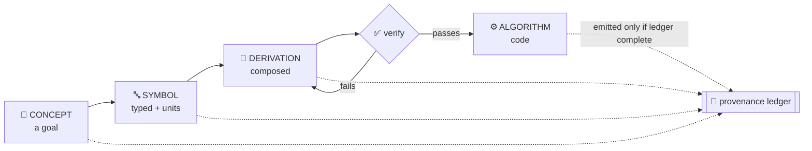
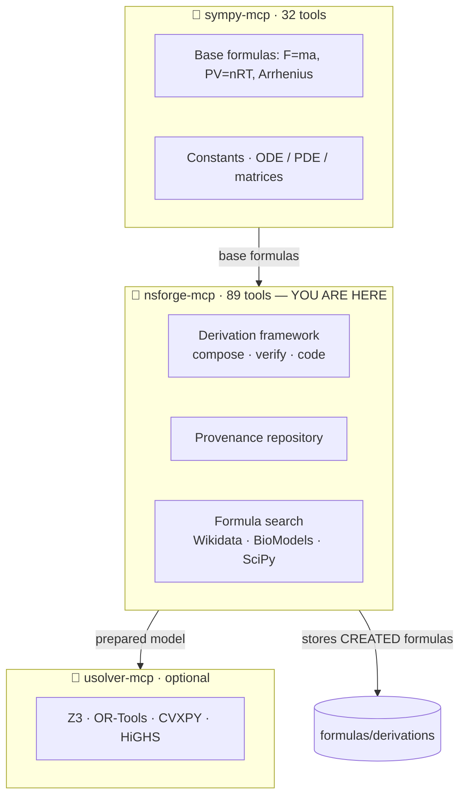
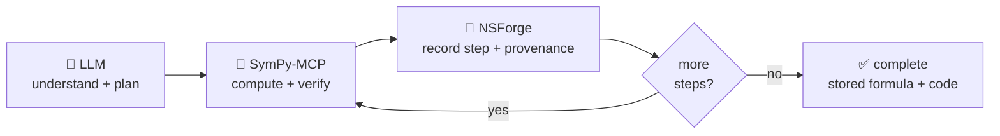
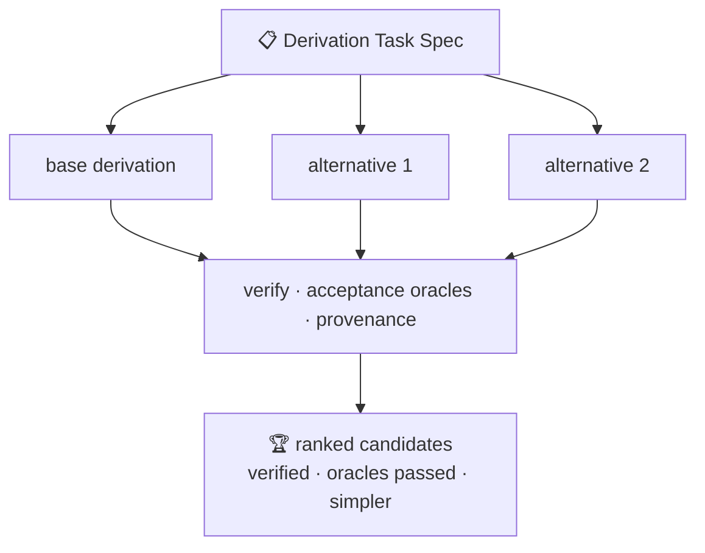
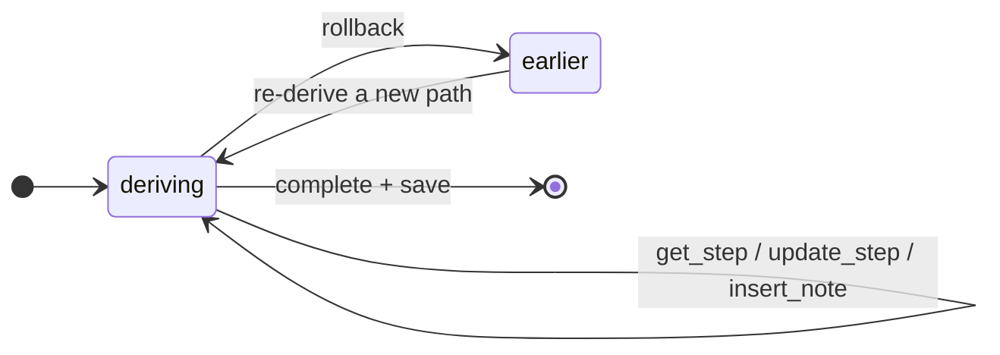
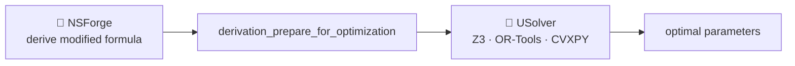

<div align="center">


# 🔥 Neurosymbolic Forge (NSForge)

**Turn *concepts* into verifiable, traceable *formulas*.**
NSForge is an [MCP](https://modelcontextprotocol.io/) server that *forges* new formulas through deterministic, provenance-tracked derivation — the AI orchestrates, tools reify.

[](LICENSE)
[](https://www.python.org/)
[](https://modelcontextprotocol.io/)
[](docs/tools-reference.md)
[](#-verification-harness)

🌐 **English** | [繁體中文](README.zh-TW.md)

</div>

---

## 💡 Why NSForge?

LLMs are great at *understanding and planning*, but doing symbolic math by hand makes them **hallucinate, contradict themselves, and produce unverifiable results**. NSForge draws a clean line:

| The LLM does… | NSForge does… |
| ------------- | ------------- |
| Understand the question | Precise symbolic computation |
| Plan the derivation | Track every step's **provenance** |
| Explain the result | **Verify** (dimensions, boundary, equivalence) |
| — | Store the formula, generate code |

> **North star:** every symbol, equation, value, and line of code in a result has a **tool call as its birth certificate**. The amount the AI computes by hand approaches zero.

**NSForge is NOT a formula database** — it's a **derivation factory**. Formulas are *inputs* (from SymPy‑MCP, Wikidata, BioModels, you); the *operators* (compose · substitute · solve · verify · prove) are the product.

---

## 🪜 The Reification Ladder

The core idea: climb from a fuzzy **concept** to executable, **provenance-bound code**, one deterministic rung at a time.

<div align="center">

</div>


```mermaid
flowchart LR
    C["💭 CONCEPT<br/>a goal"] --> S["🔤 SYMBOL<br/>typed + units"]
    S --> D["🧩 DERIVATION<br/>composed"]
    D --> V{"✅ verify"}
    V -->|"fails"| D
    V -->|"passes"| A["⚙️ ALGORITHM<br/>code"]
    A -. "emitted only if ledger complete" .-> L[["📒 provenance ledger"]]
    C -.-> L
    S -.-> L
    D -.-> L
```

> 📖 Deep dive: [Reification-ladder direction](docs/reification-ladder-direction.md) · [General-formula-exploration roadmap](docs/general-formula-exploration-roadmap.md)

---

## 🌍 Ecosystem: don't reinvent the wheel

NSForge works **with** other MCP servers, not against them.


```mermaid
flowchart TB
    subgraph SY["🔢 sympy-mcp · 32 tools"]
        direction LR
        SY1["Base formulas: F=ma, PV=nRT, Arrhenius"]
        SY2["Constants · ODE / PDE / matrices"]
    end
    subgraph NS["🔨 nsforge-mcp · 89 tools — YOU ARE HERE"]
        direction LR
        NS1["Derivation framework<br/>compose · verify · code"]
        NS2["Provenance repository"]
        NS3["Formula search<br/>Wikidata · BioModels · SciPy"]
    end
    subgraph US["🎯 usolver-mcp · optional"]
        US1["Z3 · OR-Tools · CVXPY · HiGHS"]
    end
    SY -->|"base formulas"| NS
    NS -->|"prepared model"| US
    NS -->|"stores CREATED formulas"| REPO[("formulas/derivations")]
```

| ✅ Belongs in NSForge | ❌ Use another tool |
| -------------------- | ------------------ |
| Temperature-corrected drug elimination | Basic physics formulas → sympy-mcp |
| Body-fat-adjusted volume of distribution | Physical constants → sympy-mcp |
| Renal-function dose adjustments | Clinical scores → medical-calc-mcp |
| Custom composite PK/PD models | Textbook formulas → references |

---

## 📦 Installation

**Requirements:** Python 3.12+ and [`uv`](https://docs.astral.sh/uv/) (recommended).

```bash
uv add nsforge-mcp          # or: pip install nsforge-mcp
```

<details>
<summary>From source</summary>

```bash
git clone https://github.com/u9401066/nsforge-mcp.git
cd nsforge-mcp
uv sync --all-extras
uv run python -c "import nsforge; print(nsforge.__version__)"
```
</details>

### Configure as an MCP server

```json
{
  "mcpServers": {
    "nsforge": { "command": "uvx", "args": ["nsforge-mcp"] }
  }
}
```

---

## 🎬 How it works — SymPy-MCP first

The golden rule: **compute & verify with SymPy-MCP, then record with NSForge** (provenance + human insight at every step).


```mermaid
flowchart LR
    A["🤖 LLM<br/>understand + plan"] --> B["🔢 SymPy-MCP<br/>compute + verify"]
    B --> C["🔨 NSForge<br/>record step + provenance"]
    C --> D{"more<br/>steps?"}
    D -->|"yes"| B
    D -->|"no"| E["✅ complete<br/>stored formula + code"]
```

| Task | Tool | Why |
| ---- | ---- | --- |
| Math computation | SymPy-MCP | Full ODE / PDE / matrix support |
| Formula display | `derivation_show` | User confirms each step |
| Knowledge storage | NSForge | Provenance, searchable |
| Dimension check | NSForge `check_dimensions` | Physical-unit verification |

---

## 🧭 Autonomous task orchestration (L2 / L3)

Hand NSForge a declarative **Derivation Task Spec (DTS)** and it runs the whole ladder for you. `task_explore` turns a single answer into a **space of verified answers**: it runs the base derivation plus every alternative, then ranks the survivors.


```mermaid
flowchart TD
    DTS["📋 Derivation Task Spec"] --> BASE["base derivation"]
    DTS --> ALT1["alternative 1"]
    DTS --> ALT2["alternative 2"]
    BASE --> V["verify · acceptance oracles · provenance"]
    ALT1 --> V
    ALT2 --> V
    V --> RANK["🏆 ranked candidates<br/>verified · oracles passed · simpler"]
```

- `task_plan` — reify a DTS into an ordered, provenance-tagged plan
- `task_run` — run the ladder end-to-end (optional hard `timeout_s`)
- `task_explore` — branching search returning **all** verified candidates

> 📖 [General-formula-exploration roadmap](docs/general-formula-exploration-roadmap.md)

---

## 🎛️ Step-by-step control

Navigate and edit a derivation like a version-controlled document. Expressions are immutable (that keeps verification honest) — to change a result, `rollback` to a valid state and re-derive.


```mermaid
stateDiagram-v2
    direction LR
    [*] --> deriving
    deriving --> deriving: get_step / update_step / insert_note
    deriving --> earlier: rollback
    earlier --> deriving: re-derive a new path
    deriving --> [*]: complete + save
```

`derivation_get_step` · `derivation_update_step` · `derivation_rollback` · `derivation_insert_note` · `derivation_delete_step` — see the [tool reference](docs/tools-reference.md#-derivation-engine-31).

---

## 🛠️ Tools at a glance — 89 tools, 10 modules

| Module | # | What it does |
| ------ | :-: | ------------ |
| 🔥 Derivation engine | 31 | Stateful sessions: compose, step, track, store |
| 🔢 Calculation | 12 | Limits, series, sums, inequalities, probability |
| 🔣 Advanced algebra & transforms | 14 | expand/factor/apart… + Laplace / Fourier |
| ✅ Verification | 6 | Equality, derivative, integral, dimensions |
| 🌐 Formula search | 6 | Wikidata, BioModels, SciPy constants |
| 💻 Code generation | 4 | Python, LaTeX, report, SymPy script |
| 📝 Expression | 3 | Parse, validate, extract symbols |
| 🧭 Task orchestration | 3 | `task_plan` / `task_run` / `task_explore` |
| 🧭 Suggester | 1 | Retrieval-augmented next-step ranking |
| 🎵 Music | 9 | Symbolic tones → waveform, spectrum, WAV |

> 📖 **Full list with every tool:** [Tool Reference](docs/tools-reference.md) · machine-readable [`capabilities.json`](docs/agent/capabilities.json)

---

## ✅ Verification harness

One command is the ground truth. `python scripts/check.py` runs **10 gates** — a green run is the definition of "done".

```
lint · format · type · import · manifest · test · bench · generic · provenance · diff
```

- **bench** — known derivations reproduce correctly
- **generic** — *unseen*, randomly-composed formulas derive correctly (proves NSForge is a derivation *calculus*, not a hand-built library)
- **provenance** — every benchmark derivation carries a complete tool-provenance ledger (no hand-derived leaks)

```bash
python scripts/check.py            # all gates
python scripts/check.py --json     # machine-readable (for agents)
```

---

## 📚 Derivation repository

Derived formulas are stored with full provenance — LaTeX, SymPy form, the base formulas combined, the steps taken, verification status, and clinical/physical context.

| Derivation | Domain | Description |
| ---------- | ------ | ----------- |
| [Temperature-corrected elimination](formulas/derivations/pharmacokinetics/temp_corrected_elimination.md) | PK | First-order elimination + Arrhenius |
| [NPO antibiotic effect](formulas/derivations/pharmacokinetics/npo_antibiotic_effect.md) | PK/PD | Henderson-Hasselbalch + Emax |
| [Temperature-corrected Michaelis-Menten](formulas/derivations/pharmacokinetics/temp_corrected_michaelis_menten.md) | PK | Saturable kinetics + temperature |
| [Physiological Vd by body composition](formulas/derivations/pharmacokinetics/physiological_vd_body_composition.md) | PBPK | Vd adjustment for body composition |

> 🐍 Worked example: [`examples/npo_antibiotic_analysis.py`](examples/npo_antibiotic_analysis.py)

---

## 🧠 Agent skills

NSForge ships **19 pre-built skills** that teach agents how to use the tools — 6 NSForge workflows (`nsforge-derivation-workflow`, `nsforge-formula-search`, `nsforge-verification-suite`, …) plus 13 general development skills.

> 📖 [NSForge Skills Guide](docs/nsforge-skills-guide.md)

---

## 🔗 Optional: NSForge → USolver

NSForge derives the *domain-smart* formula; [USolver](https://github.com/sdiehl/usolver) finds the *math-optimal* values.


```mermaid
flowchart LR
    N["🔨 NSForge<br/>derive modified formula"] --> P["derivation_prepare_for_optimization"]
    P --> U["🎯 USolver<br/>Z3 · OR-Tools · CVXPY"]
    U --> R["optimal parameters"]
```

> 📖 Skill: [`nsforge-usolver-collab`](.claude/skills/nsforge-usolver-collab/SKILL.md)

---

## 🏗️ Architecture & development

DDD with a pure domain core and a replaceable MCP layer (`nsforge` core has **no** MCP dependency).

```bash
uv sync --all-extras     # set up
uv run pytest            # tests
python scripts/check.py  # full harness (10 gates)
uv run nsforge-mcp       # start the server
```

> 📖 [Architecture](ARCHITECTURE.md) · [Contributing](CONTRIBUTING.md) · [NSForge vs SymPy-MCP](docs/nsforge-vs-sympy-mcp.md)

---

## 🗺️ Roadmap

Reification-ladder phases 1–6 are **live** (engine → benchmarks → suggester → self-correction → provenance → explore mode). Remaining: Lean4 formal verification (optional) and multi-agent infrastructure.

> 📖 [ROADMAP.md](ROADMAP.md) · [General-formula-exploration roadmap](docs/general-formula-exploration-roadmap.md)

---

## 📄 License

[Apache License 2.0](LICENSE)

<div align="center">

**NSForge** — *Forge new formulas through verified derivation · Where Neural meets Symbolic*

</div>
