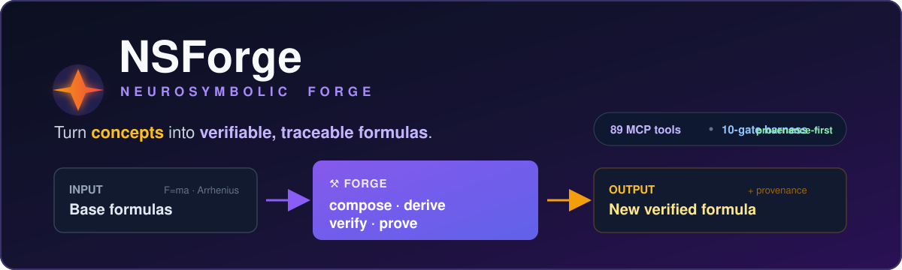
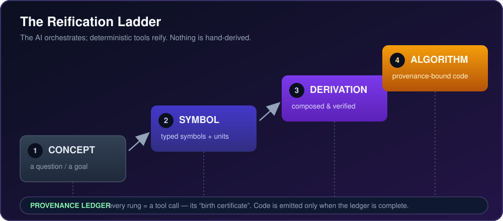
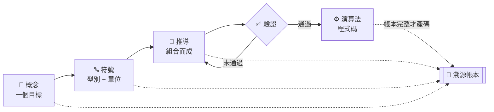
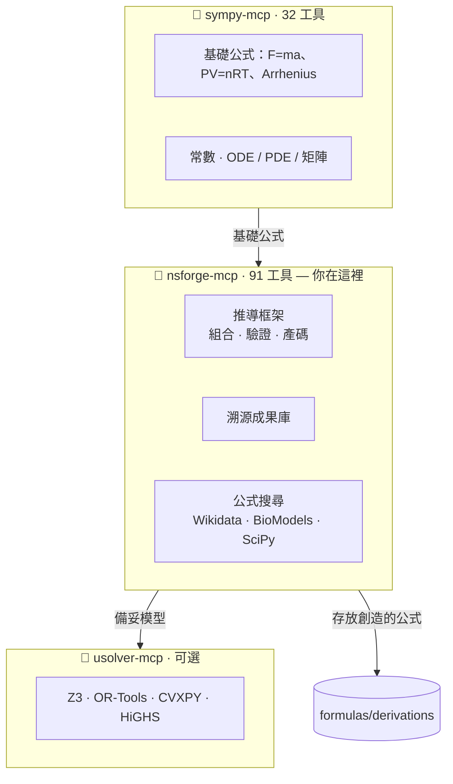
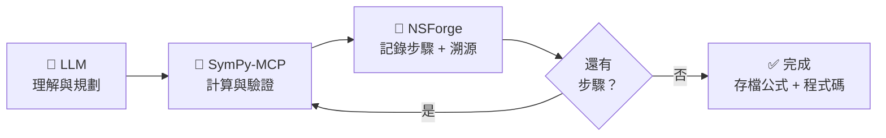
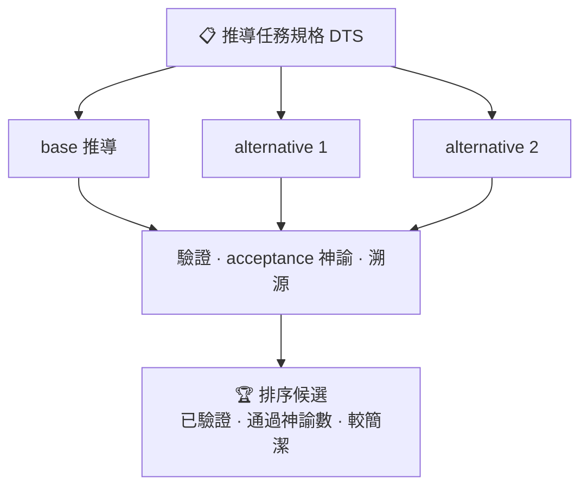
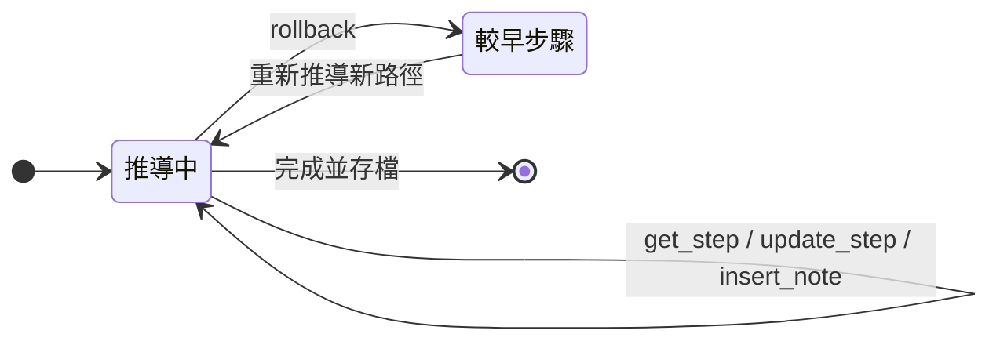

<div align="center">



# 🔥 Neurosymbolic Forge (NSForge)

**把「概念」鍛造成可驗證、可溯源的「公式」。**
NSForge 是一個 [MCP](https://modelcontextprotocol.io/) 伺服器，透過確定性、帶溯源的推導來**創造**新公式——AI 負責編排，工具負責實體化。

[](LICENSE)
[](https://www.python.org/)
[](https://modelcontextprotocol.io/)
[](docs/tools-reference.md)
[](#-驗證-harness)

🌐 [English](README.md) | **繁體中文**

</div>

---

## 💡 為什麼需要 NSForge？

LLM 擅長**理解與規劃**，但直接徒手做符號數學會**幻覺、前後矛盾、產出無法驗證的結果**。NSForge 劃出一條清楚的界線：

| LLM 負責… | NSForge 負責… |
| --------- | ------------- |
| 理解問題 | 精確符號運算 |
| 規劃推導 | 追蹤每一步的**溯源** |
| 解釋結果 | **驗證**（維度、邊界、等價） |
| — | 存放公式、生成程式碼 |

> **北極星：** 結果中的每個符號、算式、數值、程式碼都要有**工具調用作為出生證明**；AI 徒手計算的比例趨近於零。

**NSForge 不是公式資料庫** — 而是一座**推導工廠**。公式是*輸入*（來自 SymPy‑MCP、Wikidata、BioModels、你）；*運算子*（組合 · 代入 · 求解 · 驗證 · 證明）才是產品。

---

## 🪜 實體化階梯（Reification Ladder）

核心理念：從模糊的**概念**，一次一個確定性階梯，攀爬到可執行、**帶溯源的程式碼**。

<div align="center">

</div>



> 📖 深入：[實體化階梯方向](docs/reification-ladder-direction.md) · [泛公式探討路線圖](docs/general-formula-exploration-roadmap.md)

---

## 🌍 生態系：不重複造輪子

NSForge 與其他 MCP 伺服器**協作**，而非競爭。



| ✅ 屬於 NSForge | ❌ 請用其他工具 |
| -------------- | -------------- |
| 溫度修正消除率 | 基礎物理公式 → sympy-mcp |
| 體脂調整分布容積 | 物理常數 → sympy-mcp |
| 腎功能劑量調整 | 臨床評分 → medical-calc-mcp |
| 自訂複合 PK/PD 模型 | 教科書公式 → 參考文獻 |

---

## 📦 安裝

**需求：** Python 3.12+ 與 [`uv`](https://docs.astral.sh/uv/)（建議）。

```bash
uv add nsforge-mcp          # 或：pip install nsforge-mcp
```

<details>
<summary>從原始碼安裝</summary>

```bash
git clone https://github.com/u9401066/nsforge-mcp.git
cd nsforge-mcp
uv sync --all-extras
uv run python -c "import nsforge; print(nsforge.__version__)"
```
</details>

### 設定為 MCP 伺服器

```json
{
  "mcpServers": {
    "nsforge": { "command": "uvx", "args": ["nsforge-mcp"] }
  }
}
```

---

## 🎬 運作方式 — SymPy-MCP 優先

黃金法則：**先用 SymPy-MCP 計算與驗證，再用 NSForge 記錄**（每一步都帶溯源與人類洞見）。



| 任務 | 工具 | 原因 |
| ---- | ---- | ---- |
| 數學運算 | SymPy-MCP | 完整 ODE / PDE / 矩陣 |
| 公式顯示 | `derivation_show` | 讓使用者逐步確認 |
| 知識存放 | NSForge | 有溯源、可搜尋 |
| 維度檢查 | NSForge `check_dimensions` | 物理單位驗證 |

---

## 🧭 自主任務編排（L2 / L3）

交給 NSForge 一份宣告式**推導任務規格（DTS）**，它就替你跑完整條階梯。`task_explore` 把單一答案變成**驗證過的答案空間**：跑 base 推導＋每個 alternative，再對倖存者排序。



- `task_plan` — 把 DTS 實體化為帶溯源的有序計畫
- `task_run` — 端到端跑完整條階梯（可選硬逾時 `timeout_s`）
- `task_explore` — 分支探索，回傳**所有**驗證候選

> 📖 [泛公式探討路線圖](docs/general-formula-exploration-roadmap.md)

---

## 🎛️ 步進式控制

像操作版本控制文件一樣導覽與編輯推導。表達式不可直接改（維持驗證的誠實）——要改結果就 `rollback` 回有效狀態再重新推導。



`derivation_get_step` · `derivation_update_step` · `derivation_rollback` · `derivation_insert_note` · `derivation_delete_step`——詳見[工具參考](docs/tools-reference.md#-derivation-engine-31)。

---

## 🛠️ 工具總覽 — 91 工具、11 模組

| 模組 | 數 | 說明 |
| ---- | :-: | ---- |
| 🔥 推導引擎 | 31 | 有狀態會話：組合、步驟、追蹤、存放 |
| 🔢 計算 | 12 | 極限、級數、求和、不等式、機率 |
| 🔣 進階代數與變換 | 14 | 展開/因式/部分分式… + Laplace / Fourier |
| ✅ 驗證 | 6 | 等式、微分、積分、維度 |
| 🌐 公式搜尋 | 6 | Wikidata、BioModels、SciPy 常數 |
| 💻 程式碼生成 | 4 | Python、LaTeX、報告、SymPy 腳本 |
| 📝 表達式 | 3 | 解析、驗證、抽取符號 |
| 🧭 任務編排 | 3 | `task_plan` / `task_run` / `task_explore` |
| 🧭 推薦器 | 1 | 檢索增強的下一步排序 |
| 🎵 音樂 | 9 | 符號音調 → 波形、頻譜、WAV |
| 🧩 Runtime 自述 | 2 | `nsforge_health` · `nsforge_manifest`（agent harness） |

> 📖 **含每個工具的完整清單：** [工具參考](docs/tools-reference.md) · 機器可讀 [`capabilities.json`](docs/agent/capabilities.json)

---

## ✅ 驗證 Harness

一個指令即真理。`python scripts/check.py` 跑 **10 個 gate**——全綠就是「完成」的定義。

```
lint · format · type · import · manifest · test · bench · generic · provenance · diff
```

- **bench** — 已知推導能正確重現
- **generic** — *未曾手寫*、隨機組合的公式也能正確推導（證明 NSForge 是推導*演算法*，而非手建公式庫）
- **provenance** — 每個 benchmark 推導都帶完整溯源帳本（無徒手推導洩漏）

```bash
python scripts/check.py            # 所有 gate
python scripts/check.py --json     # 機器可讀（供 agent）
```

---

## 📚 推導成果庫

推導出的公式帶完整溯源存放——LaTeX、SymPy 形式、組合了哪些基礎公式、推導步驟、驗證狀態、臨床／物理脈絡。

| 推導 | 領域 | 說明 |
| ---- | ---- | ---- |
| [溫度修正消除率](formulas/derivations/pharmacokinetics/temp_corrected_elimination.md) | PK | 一階消除 + Arrhenius |
| [NPO 抗生素效應](formulas/derivations/pharmacokinetics/npo_antibiotic_effect.md) | PK/PD | Henderson-Hasselbalch + Emax |
| [溫度修正 Michaelis-Menten](formulas/derivations/pharmacokinetics/temp_corrected_michaelis_menten.md) | PK | 飽和動力學 + 溫度 |
| [依身體組成的生理性 Vd](formulas/derivations/pharmacokinetics/physiological_vd_body_composition.md) | PBPK | 依身體組成調整 Vd |

> 🐍 完整範例：[`examples/npo_antibiotic_analysis.py`](examples/npo_antibiotic_analysis.py)

---

## 🧠 Agent 技能

NSForge 內建 **19 個技能**，教 agent 如何有效使用工具——6 個 NSForge 工作流（`nsforge-derivation-workflow`、`nsforge-formula-search`、`nsforge-verification-suite`…）加上 13 個通用開發技能。

> 📖 [NSForge 技能指南](docs/nsforge-skills-guide.md)

---

## 🔗 可選：NSForge → USolver

NSForge 推導出*懂領域*的公式；[USolver](https://github.com/sdiehl/usolver) 找出*數學最佳*的數值。


> 📖 技能：[`nsforge-usolver-collab`](.claude/skills/nsforge-usolver-collab/SKILL.md)

---

## 🏗️ 架構與開發

DDD 架構，純領域核心搭配可替換的 MCP 層（`nsforge` 核心**不依賴** MCP）。

```bash
uv sync --all-extras     # 環境
uv run pytest            # 測試
python scripts/check.py  # 完整 harness（10 gate）
uv run nsforge-mcp       # 啟動伺服器
```

> 📖 [架構](ARCHITECTURE.md) · [貢獻指南](CONTRIBUTING.md) · [NSForge vs SymPy-MCP](docs/nsforge-vs-sympy-mcp.md)

---

## 🗺️ 路線圖

實體化階梯階段 1–6 **已落地**（引擎 → 評測 → 推薦器 → 自我修正 → 溯源 → explore mode）。剩餘：Lean4 形式驗證（可選）與多 agent 基礎設施。

> 📖 [ROADMAP.md](ROADMAP.md) · [泛公式探討路線圖](docs/general-formula-exploration-roadmap.md)

---

## 📄 授權

[Apache License 2.0](LICENSE)

<div align="center">

**NSForge** — *透過驗證式推導鍛造新公式 · 神經與符號的交會*

</div>
