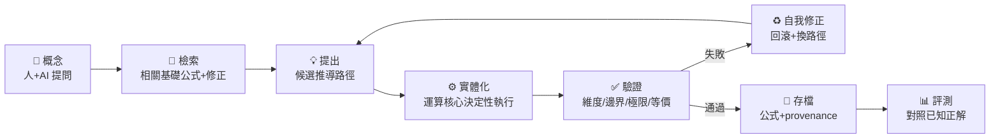

# 泛公式探討路線圖（General Formula Exploration）

> **Date**: 2026-07-07
> **Status**: 🧭 Construction Blueprint（施工藍圖）
> **Builds on**: `docs/reification-ladder-direction.md`（實體化階梯）、自駕基座 L0–L3
> **Informed by**: GitHub 相似專案盤點（見下方「學自哪個 repo」）

---

## 0. 定位：為什麼是「泛公式探討」

經 GitHub 大量盤點確認，NSForge 的組合——**MCP 原生 + 多步推導 + provenance + 公式創造**——幾乎無直接競品：

- 市面 MCP 數學伺服器（sympy-mcp、arithma、Wolfram MCP…）大多是**單發計算、防幻覺的包裝器**。
- 學術端（LLM-SR、lean-dojo…）強在**方程發現 / 定理證明**，但非 MCP 原生工具、也不做步進式推導工作流。

**缺口不是單一能力，而是把這些能力串成一個可驗證的「探索迴圈」。** 這份文件就是把該迴圈「慢慢建起來」的藍圖。

---

## 1. 「泛公式探討」= 一個可驗證的探索迴圈

北極星不變（見實體化階梯）：**每個出現在結果裡的符號/等式/數值/程式碼，都要有工具產生的 provenance；AI 不徒手生。**

---

## 2. 三支柱 × 迴圈段落 × 學自哪個 repo

| 支柱 | 負責迴圈段落 | 現況 | 學自哪個 repo |
|------|-------------|------|--------------|
| **運算核心**（SymPy / 推導引擎 / 驗證） | 實體化、驗證 | ✅ 88 工具；階梯全通＋provenance 強制(北極星落地) | 自己 |
| **harness**（自駕基座） | 評測、讓自主建構安全 | ✅ L0/L1；✅ 評測+通用性 | [llm-srbench](https://github.com/deep-symbolic-mathematics/llm-srbench)(113★) |
| **輔助 agent**（AI 編排） | 檢索、提出、自我修正 | 🟢 L3 執行 + 推薦器 + 自我修正（階段 3-4） | [ReProver](https://github.com/lean-dojo/ReProver)(327★)、[group-theoretic-agentic-pipeline](https://github.com/anantshri1/group-theoretic-agentic-pipeline)、[LLM-SR](https://github.com/deep-symbolic-mathematics/LLM-SR)(259★)/[TPSR](https://github.com/deep-symbolic-mathematics/TPSR)(82★) |

---

## 3. 分階段路線圖（依相依性、先安全後大改）

| 階段 | 目標 | 支柱 | 學自 | 風險 | 依賴 |
|------|------|------|------|------|------|
| **0** ✅ | 運算核心(87)+harness(L0/L1)+DTS(L2)+編排器骨架(L3) | 全 | — | — | — |
| **1** ✅ | **接通 L3 引擎**：DTS 的 derivation 階段從 `PLANNED` → 實際驅動推導引擎 | 核心+agent | 自己 | 中 | 0 |
| **2** ✅ | **推導評測 + 通用性 gate**：`scripts/bench.py`（推導正確率）＋ `scripts/genericity.py`（任意未見組合正確＝不退化成庫），把「程式碼綠」升級成「推導正確＋通用」 | harness | llm-srbench | 低 | 0 |
| **3** ✅ | **檢索增強**：`derivation_suggest_next(goal, 現況)` → 排序候選步驟/公式/修正 | agent | ReProver | 低中 | 2 |
| **4** ✅ | **自我修正環**：base 推導未通過 acceptance → 逐一試 `alternatives` 候選 → 取第一個通過者（記 `attempts`） | agent+核心 | group-theoretic pipeline | 中 | 1,3 |
| **5** ✅ | **provenance ledger 強制**：每推導帶出生證明帳本，codegen 只在溯源完整時產碼（`provenance` gate） | 核心 | provenance-neurosymbolic | 中 | 1 |
| **6** | **explore mode**：分支推導樹的泛探索迴圈（提問→自動跑完整迴圈→多條驗證過的新公式） | 全 | LLM-SR / TPSR | 高 | 1–5 |
| **7**（可選/長期） | **Lean4 驗證後端**：最高保證等級的形式驗證 | 核心 | lean-dojo | 高 | 5 |

**關鍵原則**：每一階都小、都對 `scripts/check.py` 驗證、都可逆——這正是自駕基座（安全網）的用途：讓「慢慢建」不會越建越壞。

---

## 4. 各階段細節

### 階段 1 — 接通 L3 引擎 ✅ 已實作（commit 2b5368f）
`application/task_orchestrator.py` 的 `run()` DERIVATION 階段實際透過 domain `SymbolicEngine` 組合 base_formulas（代入鏈）→ `derived_expression`，每步記 provenance；無法處理者（ODE、複雜矩陣）保留 `PLANNED` 擴充點（走 handoff）。`Modification` 加 `target` 支援自動代入。

### 階段 2 — 推導評測 + 通用性 gate ✅ 已實作
`benchmarks/*.json`（4 個已知推導：PK/力學/電路，DTS + 期望算式）+ `scripts/bench.py` 用引擎 `equals` 符號比對（順序無關）、輸出正確率。已納入 `scripts/check.py` 成為 `bench` gate。題庫未來可借 llm-srbench。

**通用性證明（不退化成公式庫）✅**：`scripts/genericity.py` 程序化隨機生成「從沒手寫過」的公式組合（目標式＋各變數的獨立定義），過 L3 編排器後，與**獨立**用 SymPy `.subs()` 算出的參考答案（走完全不同的程式路徑，繞過 NSForge parse/substitute/compose）交叉比對。40/40 通過＝引擎對**任意未見公式**都能通用組合，證明「公式是輸入、運算子才是我們的」。納入為 `generic` gate → harness 從 7 升級為 **9 gate**。這是「怎樣不流於自建整個公式庫」的結構性答案，也要求階段 3 的檢索指向開放來源、而非手建目錄。

### 階段 3 — 檢索增強（推薦器）✅ 已實作
`derivation_suggest_next(goal, current_expression, candidates)`（`domain/suggester.py` 純排序 + `tools/suggest.py`）：agent 從**開放來源**檢索候選（`formula_search` 的 Wikidata/BioModels/SciPy、會話公式、通用運算），本工具依「候選是否定義現況中出現的符號（可代入推進）＋目標詞重疊」排序——retrieve-then-rank（學自 ReProver）。**NSForge 擁有排序、不擁有公式目錄**（呼應通用性 gate）。直接解 `docs/cognitive-load-solution.md` 的「AI 不知該套哪個修正」。

### 階段 4 — 自我修正環（critic-retry）✅ 已實作
`task_run` 的 `run()` 成為重試迴圈：先跑 base 推導 + acceptance 神諭；未通過則依 DTS 新增的 `alternatives`（候選修正）逐一（base + 該候選）重新組合、重跑 acceptance，**取第一個通過者**，全程記於 `attempts`（每次 label/derived/verified）。DTS 新增 `alternatives: list[Modification]`；`TaskRunResult` 新增 `attempts`。向後相容（無 alternatives 時等同單次）。這把「探索→驗證→修正→再驗證」閉環（學自 group-theoretic critic-retry）。候選未來可由階段 3 `derivation_suggest_next` 排序後餵入。

### 階段 5 — provenance ledger 強制 ✅ 已實作
`domain/provenance.py`（`ProvenanceEntry`/`ProvenanceLedger`，純）：每個推導組一本帳——base 公式＝`input:base_formula`、每個執行步驟＝其工具（`engine.substitute`/`engine.solve`）、最終＝`engine.simplify`；`is_complete` = 每個 entry 都 tool-sourced。orchestrator `_build_ledger` 建帳，`run()` 強制「**codegen 只在 provenance 完整時產碼**」（否則 ALGORITHM 標 PLANNED「refused: 無溯源」）；`task_run` 輸出 provenance。`scripts/provenance.py` 成第 10 個 gate：跑每個 benchmark、斷言溯源完整（5/5），把北極星從約定升級成**可強制的架構不變量**。每符號級溯源列未來深化。

### 階段 6 — explore mode
`explore(concept)`：分支推導樹，對每條路徑跑「檢索→提出→實體化→驗證→自我修正」，用評測 gate 排序，產出多條驗證過、帶 provenance 的候選新公式。這是「泛公式探討」的完全體。

### 階段 7 —（可選）Lean4 驗證後端
最高保證：把關鍵推導轉 Lean4 驗證。lean-dojo（LeanDojo→ReProver→TorchLean）是現成 on-ramp。`decisionLog` 已記「MVP 暫不含 Lean4」——此為長期選項。

---

## 5. 建議施工順序

1. ✅ **階段 1（接通 L3 引擎）** — 骨架變成「真的會跑」，探索迴圈的地基。
2. ✅ **階段 2（評測 + 通用性 gate）** — 「推導正確率」成 `bench` gate、「任意未見組合正確」成 `generic` gate（杜絕退化成公式庫），後續自主探索有信任基礎。
3. ✅ **階段 3-4（檢索增強 + 自我修正環）** — `derivation_suggest_next` 排序開放來源候選；`run()` 重試 `alternatives` 取第一個通過 acceptance 者（`attempts` 溯源）。
4. ✅ **階段 5（provenance 強制）** — codegen 只在 provenance ledger 完整時產碼、`provenance` gate（harness 9→10）鎖住不變量；北極星落地為架構。**階段 6（explore mode）** ← 下一步。
5. **階段 6（explore mode）** — 泛探索完全體。
6. **階段 7（Lean4）** — 長期選項。

---

## 6. 一句話

> 泛公式探討 = 把「探索 → 提出 → 實體化 → 驗證 → 自我修正 → 存檔 → 評測」這個迴圈的每一段都工具化，讓運算核心負責決定性實體化與驗證、harness 負責度量、輔助 agent 負責探索與修正——每一步都可驗證、可追溯、可重現。
