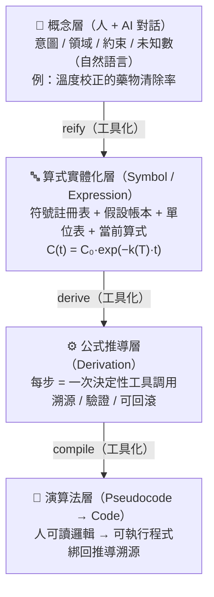

# 方向收斂：實體化階梯（Reification Ladder）

> **Date**: 2026-07-07
> **Updated**: 2026-08-31（NSForge 0.3.0 / MCP 2.1.1）
> **Status**: ✅ Active Architecture Direction（現行架構方向）
> **Trigger**: 用戶提出核心命題——「讓公式推導、算式實體化、pseudocode 都能從概念變成具體呈現；人與 AI 只在概念層對話，機械式步驟一律工具化」
> **Supersedes/Consolidates**: `value-proposition-analysis.md`、`design-evolution-derivation-framework.md`、`composable-formula-modification-engine.md`、`reproducible-derivation-tools.md`、`cognitive-load-solution.md` 的核心洞見

---

## 0. 這份文件的定位

NSForge 的願景其實**已經想得很透**，但散落在 6 份 `docs/` 設計文件裡，而正典位置（`memory-bank/projectBrief.md`、`productContext.md`）到 2026-07 為止仍是通用模板內容。

這份文件的目的是把北極星**收斂成一句判準 + 一座階梯 + 四個決策 + 一條路線圖**，讓後續每個實作都能對齊，也讓人類能一次看懂並校正方向。

> 本文起初是自主拍板的提案；目前北極星已成為 AGENTS、provenance gate、capability manifest 與 MCP server instructions 共同守衛的現行方向。四個 ADR 的未完成部分仍可經正式決策調整。

---

## 1. 核心命題：實體化階梯

用戶的命題可以精準表述為一個**分工原則**：

> **人與 AI 只在「概念層」對話；所有機械性、決定性的步驟都下放給工具「實體化」。**

把它畫成一座階梯——每一根向下的箭頭，都是一個「本來 AI 用手算、現在改由工具決定性產生」的步驟：



**AI 的角色因此從「生產者」轉為「編排者 + 翻譯者」。**
- 生產者思維：AI 徒手寫出公式 / 算式 / 程式碼 → 不可重現、會幻覺、難驗證。
- 編排者思維：AI 把概念翻譯成工具調用序列，由工具決定性地產出實體 → 可重現、可驗證、可追溯。

---

## 2. 北極星判準（可驗證的成功定義）

> **凡是出現在最終結果裡的符號 / 等式 / 數值 / 程式碼，都必須有一次工具調用作為它的「出生證明」(provenance)。AI 不得徒手生出任何一個。**

這一句同時定義了三件事：
1. **成功** = AI 徒手算的東西趨近於零。
2. **可驗證性** = 每個實體都能回溯到產生它的工具與輸入。
3. **信任邊界** = 沒有出生證明的東西，不准進入下一階（見決策 D）。

---

## 3. 現況對照：這座階梯已經走到哪

| 階梯 | 現有能力 | 狀態 |
|------|----------|------|
| 概念層 | 結構化 DTS、`task_plan`、`task_run`、`task_explore` | 🟡 goal／constraints／alternatives 已實體化；尚無完整 Concept lifecycle tools |
| 算式實體化 | SymPy-MCP `intro_many` / `introduce_expression` + NSForge session | ⚠️ **實體被切成兩半**，靠 `export_for_sympy` / `import_from_sympy` 手動搬運 |
| 公式推導 | 31 個 derivation tools + L3 orchestration／explore／provenance | ✅ 最成熟；全目錄 91 tools、預設 82 |
| Pseudocode→Code | provenance-complete `task_run` 產碼 + 4 個 codegen tools | 🟡 未驗證或溯源不完整時拒絕產碼；仍缺獨立 pseudocode 檢查點 |
| 列出實體 | `derivation_show()`、`nsforge://manifest`、已存推導 resource template | 🟡 discovery 已補齊，仍非完整 materialization-state 檢視器 |

---

## 3.5 實作進度（更新至 2026-08-31）

目前由 `python scripts/check.py` 的 12 個 gate 持續守衛：

| 元件 | 產物 | 狀態 |
|------|------|------|
| **L0 驗證 harness + CI** | `scripts/check.py`、`.github/workflows/ci.yml`（12 gates） | ✅ 已實作 |
| **L1 能力清單** | `scripts/gen_capabilities.py`、capability manifest v3（91 catalog／82 default） | ✅ 已實作 |
| **L2 宣告式任務規格 DTS** | `src/nsforge/domain/task_spec.py`（`DerivationTaskSpec`） | ✅ 已實作 |
| **L3 編排器 + explore** | `task_plan`／`task_run`／`task_explore` | ✅ 推導、acceptance、critic-retry、provenance、codegen 已接通 |
| **MCP 2.1 協議面** | structured output、tool metadata、resources、prompt、progress、`mcp` gate | ✅ 加法式升級；v0.2.4 tool contract 受回歸測試保護 |
| agent harness 去污染 | `AGENTS.md`、`.clinerules/*` 改 NSForge 專屬 | ✅ 已實作 |
| provenance 強制 | `domain/provenance.py` + `provenance` gate | ✅ derivation-level ledger 完整才產碼 |
| 完整實體檢視器／pseudocode 階／引擎單一狀態 | — | ⏳ 仍在路線圖 |

> L2/L3 已讓「大型推導任務」成為可跑的宣告式規格：DTS → 編排器 → 驗證／修正／探索 → provenance-complete algorithm。下一個架構缺口是把 session、符號假設、單位與 handoff 收斂為完整 materialization-state read model。

---

## 4. 四個「概念→實體」的斷點（診斷）

1. **概念層只完成一半。** DTS 已承載 goal、base formulas、modifications、acceptance 與 alternatives，但尚無可持續增修、列出的完整 Concept lifecycle。
2. **實體被兩個引擎瓜分。** `NSForge session` 與 `sympy-mcp state` 各持一半當前實體，靠 handoff 搬運且有損。問「現在到底有哪些符號、什麼假設、單位、算式」時答案散在兩邊。
3. **Pseudocode 這一階被跳過。** `codegen.py` 是「已驗證步驟 → Python」，缺了 pseudocode 那個**人在邏輯層把關**的中間檢查點。
4. **信任邊界已結構化到 derivation-level。** provenance ledger 與 gate 已禁止未完整溯源的 L3 codegen；尚待把覆蓋粒度深化到每個 symbol／value 與其他獨立 codegen 入口。

---

## 5. 目標架構：實體化狀態（Materialization State）

引入一個**唯一真相來源**，讓「用工具列出實體」成為一等公民：

```
實體化狀態（單一、隨時可查詢）
├── 概念卡        intent / domain / goal / constraints / open_questions
├── 符號註冊表    {C, t, k, T, Ea, R, A} + 型別
├── 假設帳本      k>0, T>0, real, positive
├── 單位表        [C]=mg/L, [T]=K, [k]=1/h
├── 當前算式      C(t) = C₀·exp(−k(T)·t)
├── 推導樹        每步的工具、輸入、輸出、驗證狀態
├── 出生證明帳本  每個符號/算式 ← 哪次工具調用產生（provenance）
└── 產出物        pseudocode / code / LaTeX（都綁回推導溯源）
```

- **sympy-mcp 退居「計算後端」**，不再是使用者要手動打交道的第二個狀態。
- **`derivation_show()` 進化成完整「實體檢視器」**——這就是用戶要的「用工具列出實體」。
- **Pseudocode 補上一階**：概念 →（工具）pseudocode → 人確認 →（工具）code。

---

## 6. 四個關鍵決策（ADR）

### ADR-D-A：唯一真相來源 → NSForge session 吸收 sympy-mcp 為純計算後端

- **決定**：長期目標是單一實體化狀態；使用者/AI 不再手動 handoff。
- **理由**：最乾淨的「列出實體」UX、消除有損搬運、對齊實體化階梯。
- **取捨與去風險**：**不做 big-bang 重寫**。先在既有 session 上蓋一層 read-only 的實體檢視器（Phase 1），再逐步把目前 handoff 出去的 sympy 調用內部化（Phase 5）。handoff 機制在收斂完成前保留。

### ADR-D-B：概念成為一等公民物件（可漸進實體化）

- **決定**：新增結構化 `Concept` 物件並向下 reify。
- **形狀**：`{ intent, domain, goal_expression, candidate_principles, candidate_modifications, constraints, open_questions, unknowns }`。
- **理由**：能「列出概念層的實體」，並直接承接 `cognitive-load-solution.md` 的「修正建議器（modification suggester）」——由工具告訴 AI「此情境該考慮哪些修正」，而非靠 AI 記憶。

### ADR-D-C：Pseudocode 補成明確一階（概念 → pseudocode → code）

- **決定**：`generate_python_function` 之前插入 `generate_pseudocode` 檢查點。
- **理由**：給人一個**邏輯層**把關點——這正是「把機械式步驟工具化」套用到寫程式：人先確認演算法邏輯，工具再實體化成程式碼，且程式碼綁回 provenance。

### ADR-D-D：信任邊界結構化（Provenance Ledger）

- **決定**：每個符號/算式/步驟都攜帶「出生證明」（哪次工具調用產生）；完整 L3 workflow 在 codegen 前驗證 provenance 覆蓋率，**拒絕沒有出生證明的實體**。
- **理由**：把北極星判準從軟約定升級為架構保證。
- **實作狀態**：原提案考慮先以警告過渡；目前 L3 task codegen 已在 ledger 不完整時硬性拒絕。Session `derivation_complete` 與獨立 codegen tools 尚未套用同一 hard gate，為保留既有 payload／workflow 相容性，本版不宣稱它們已強制拒絕。

---

## 7. 去風險路線圖

依「先讀後寫、先安全後大改」排序：

| Phase | 目標 | 風險 | 對應決策 |
|-------|------|------|----------|
| **P0 ✅** | 正典對齊：本文件、Memory Bank、decision log | 極低（純文件） | — |
| **P1 🟡** | **實體檢視器**：`derivation_show()`、manifest／health／saved-derivation resources 已提供局部 read model；仍待符號／假設／單位／推導樹的單一檢視 | 低（唯讀、加法式） | B 的前置 |
| **P2 ✅／🟡** | **Provenance Ledger**：derivation-level ledger 與 codegen hard gate 已落地；每符號／值粒度仍待深化 | 中 | D |
| **P3 🟡** | **Concept 層**：DTS 與 suggester 已落地；`concept_define` 等完整 lifecycle 尚未實作 | 中 | B |
| **P4 ⏳** | **Pseudocode 階梯**：`generate_pseudocode` 檢查點，code gen 綁 provenance + pseudocode | 中 | C |
| **P5 🟡** | **引擎收斂**：L3 已直接驅動本地 symbolic engine；複雜操作 handoff 與雙狀態仍存在 | 高（最後做） | A |
| **MCP ✅** | **協議基座**：MCP 2.1.1 structured output、metadata、resources、prompt、progress、cache hints 與相容性 gate | 低（加法式、契約受測） | 全階段 |

**排序理由**：P1 唯讀、加法式、立即兌現「列出實體」的價值且幾乎零風險；P2 讓北極星有牙齒；P3/P4 補概念與 pseudocode 兩階；P5 這種會動到能運作系統的大改留到最後、且漸進式進行。

---

## 8. 風險與開放問題（留給人類 review）

1. **A 的成本**：完全吸收 sympy-mcp 工程量大。是否接受「永遠保留 handoff、只做統一檢視器」的折衷（決策 A 的次選）？
2. **Concept 的邊界**：概念層要多結構化？過度結構化會變回被否決的「完整模板」老路（見 `design-evolution`）。建議只結構化到「能列出 + 能承接修正建議器」為止。
3. **Provenance 的嚴格度**：硬性拒絕 vs 覆蓋率警告，切換時機為何？
4. **Pseudocode 的語言中立性**：pseudocode 要不要語言中立（偽碼），還是直接產「帶註解的 Python 骨架」當作 pseudocode？
5. **DDD 落點**：實體化狀態、Concept、Provenance 應落在 `domain/`（值物件/實體）還是 `application/`（用例編排）？依現有 DDD 慣例，狀態模型入 domain、工具編排入 application。

---

## 9. 一句話總結

> NSForge 的方向 = **把「概念 → 實體」的每一階都工具化，讓 AI 只負責翻譯與編排，工具負責決定性地產出可驗證、可追溯的符號 / 推導 / 演算法。成功的度量，是 AI 徒手算的東西趨近於零。**
