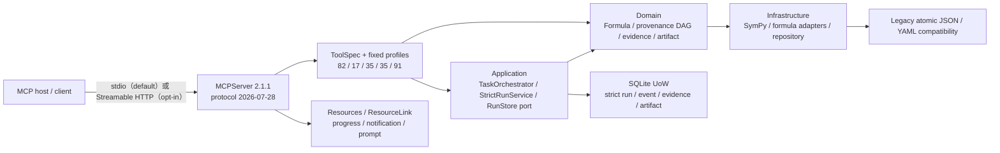

# System Architect

> 📌 此檔案記錄 NSForge 的現行架構與重大架構決策；架構變更時同步更新。

## 現行架構（2026-08-31）



依賴方向保持為：

```text
MCP boundary → Application → Domain ← Infrastructure
```

- Strict domain 值物件不做 I/O，也不依賴 MCP 或 infrastructure。歷史
  `DerivationSession` JSON 持久化仍是待移出的 legacy compatibility 債務。
- `src/nsforge_mcp/composition.py` 是 process-wide object graph 的唯一組裝點。
- `src/nsforge_mcp/server.py` 只處理 MCP metadata、lifespan 與 transport wiring。
- `EnvelopeMCP` 在單一註冊邊界為所有工具加 error semantics、title、icons、
  annotations、`_meta` 與明確 structured output，不複製 91 個 handler contract。
- Capability manifest v4 與 `mcp` gate 鎖定五個 exact profiles、strict constraints、
  legacy payload、ResourceLink／resources／progress／notifications 與 stdio framing。

## ADR-005：Trusted workflow、ToolSpec profiles 與 immutable run store

**日期**：2026-08-31
**狀態**：Accepted（supersedes ADR-004 中只有 process-state 的 trusted-workflow 部分）

### 背景

91 個工具在 compatibility 上必須保留，但對 agent discovery 過大；另一方面，
SymPy `parse_expr`／`sympify` 會執行所生成的 Python，legacy provenance 只檢查
tool name 非空，且驗證失敗仍可能產碼。JSON／YAML 與 process globals 也無法提供
atomic evidence／artifact transaction 或 tenant-scoped immutable resources。

### 決定

1. Release dependency 精確 pin `mcp==2.1.1`；manifest 升為 schema v4，harness
   擴為 14 gates，新增 `security` 與 isolated `package` smoke。
2. 中央 `ToolSpec` 定義 91 catalog 與固定 profiles：legacy 82（預設）、
   workflow 17、scientific 35、interactive 35、full 91。Compact profiles
   fail-closed validation；legacy/full 保留 payload 相容。
3. Caller expression 統一經 allowlisted no-eval parser；repository／artifact／music
   paths 必須 root-contained 且不得 symlink escape。
4. Strict domain 物件為 immutable run／phase event／provenance node／verification
   evidence／content-addressed artifact。只有 kernel evidence pass 且 tenant／subject／
   revision／policy／DAG 全部一致時可產碼。
5. Application 透過 `RunStore` / Unit of Work port 提交，SQLite adapter 以單一
   transaction 寫入。MCP 透過 run／event／artifact resources、detached session
   snapshot、`ResourceLink`、
   resource-updated notification 與 phase progress 對外呈現。
6. Phase event 是 provenance、progress、persistence 與 OTel event 的共同真相；
   spans 只帶 correlation identifiers，不放 sensitive payload。

### 結果與限制

- 91 個能力不消失，但 agent 可以 17-tool workflow 操作；讀取以 resources
  取代 compact profile 的重複 read tools。
- Legacy sessions／current fallback／JSON／YAML 仍是 process-global 相容層；strict
  SQLite 是 trusted workflow authority，但不是 cross-replica shared store。
- `NSFORGE_TENANT_ID` 不是 authentication。無 IdP／principal resolver 時，一個
  instance 只能當一個 tenant trust boundary。
- 取消 `asyncio.to_thread` await 不會殺掉 worker；不誤發 Finished，需 hard
  timeout 時使用可 terminate process。
- MCP Python SDK 2.1.1 尚未實作 Tasks extension，本版不宣稱支援。

## ADR-004：MCP 2.1 boundary、transport 與並行模型

**日期**：2026-08-31
**狀態**：Accepted（v0.4 dependency selection 由 ADR-005 精確 pin 決策取代）

### 背景

MCP Python SDK 2.x 以 `MCPServer` 取代 `FastMCP`，同步 handlers 可能在 worker
threads 並行執行。NSForge 同時有 process-wide session registry、legacy current
session fallback、saved-result repository 與磁碟持久化；若只做 import 遷移，會暴露
lost update、torn read、半寫檔案與跨 client state 誤用。

### 決定

1. v0.3 採 stable MCP SDK 2.1.1（當時 dependency 支援 `>=2.1.1,<3`，lock 與
   release gate 固定驗證 2.1.1）及 protocol revision `2026-07-28`；v0.4 已由
   ADR-005 改為 `mcp==2.1.1`。
2. stdio 保持預設；Streamable HTTP 只在明確 opt-in 時啟動，預設綁 loopback。
3. 所有 HTTP bind 都傳入 `TransportSecuritySettings` 驗證 Host／Origin，防 DNS
   rebinding。Non-loopback 另要求 remote acknowledgement、非空 Host allowlist，並在
   server 外提供真正的 authentication、authorization 與 TLS。
4. Process-wide sessions、legacy fallback 與 repository 是單一 trust boundary。
   Multi-client 的每個 stateful derivation call 必須傳 explicit `session_id`；每 tenant
   部署獨立 instance。Legacy fallback 僅供 single-client 相容，不是 caller isolation。
5. `SessionManager`、每個 `DerivationSession` 與 `DerivationRepository` 使用 re-entrant
   locks；mutation／compound transaction 序列化，compound reads 與 completion 回傳
   detached point-in-time snapshots。JSON／YAML 使用同目錄 temp file + `os.replace`。
6. 不把 SDK 尚未實作的 MCP Tasks、deprecated SSE／Roots／Sampling／Logging，或沒有
   IdP 的假 OAuth 包裝成已支援功能。

### 結果與限制

- 不同 sessions 可並行；同一 session 的 mutation 不交錯，讀取只看到單一快照。
- 鎖與 atomic replace 保證單 process 一致性，不是跨 process distributed lock。
- Resource metadata／public cache hints 不是授權。Saved-derivation resource 只提供已
  儲存的 metadata 與 lineage 摘要，不宣稱完整 provenance ledger。
- `NSFORGE_MCP_HTTP_JSON_RESPONSE=1` 沒有 request-scoped notification wire，因此不
  串流 `task_run`／`task_explore` progress；需要進度時維持預設 streaming mode。

## 主要元件責任

| 元件 | 責任 |
| --- | --- |
| MCPServer / primitives | Protocol negotiation、discovery、resources、prompt、transport |
| Envelope / tool contract | 91 工具的統一 metadata、structured dual channel、`isError` |
| TaskOrchestrator / Explorer | L2/L3 編排、驗證、自我修正、候選探索 |
| DerivationSession | Stateful derivation、steps、point-in-time snapshots、JSON persistence |
| ProvenanceLedger | 工具來源 birth certificates；完整性是 codegen 前置條件 |
| DerivationRepository | Saved-result index、metadata/lineage snapshot、atomic YAML persistence |
| SymPy / adapters | Deterministic symbolic computation 與 open-world formula retrieval |
| Harness | 14 gates：程式品質、security、推導正確性、provenance、package、自描述與 MCP wire contract |

## 歷史決策摘要

- **ADR-001（2025-12-15）**：憲法／子法／Skills 規則層級；仍作 agent governance。
- **ADR-002（2025-12-15）**：採 DDD 邊界，domain 不依賴 I/O adapter；現行程式維持。
- **ADR-003（2025-12-15）**：uv 優先套件與 lockfile；現行 release／gate 維持。
- Lean4／Principles Library 是長期可選方向，不是 NSForge 0.4.0 runtime dependency。

---

*Last updated: 2026-08-31 12:37 UTC*
